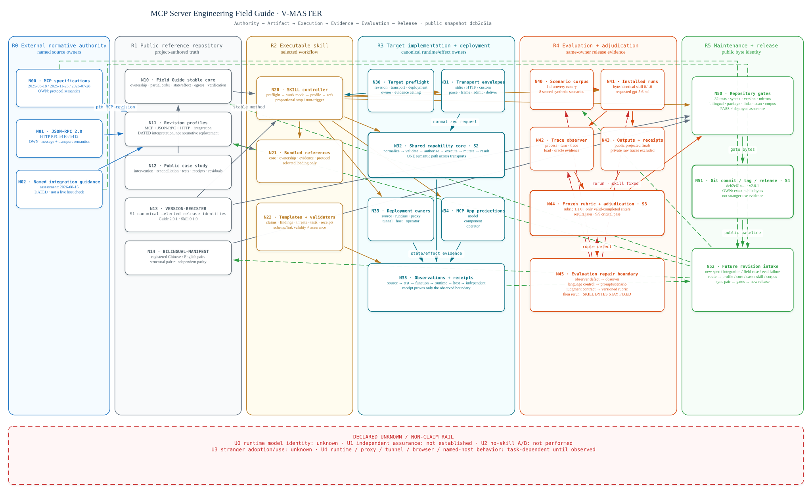
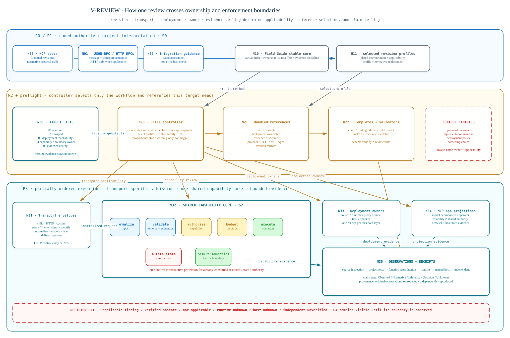
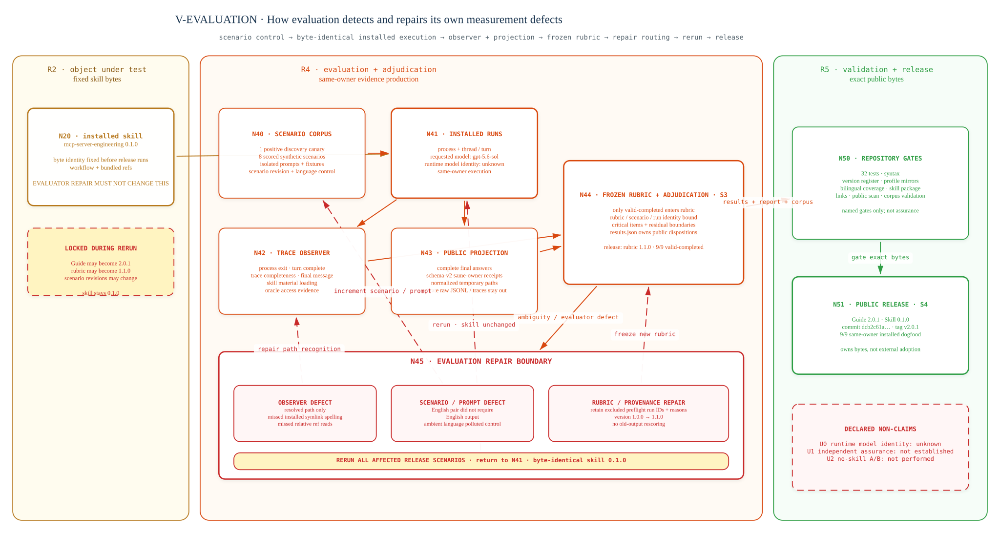

# Architecture atlas

[简体中文](ARCHITECTURE.zh-CN.md) · English

This atlas is a public, evidence-bounded reconstruction of how the Field Guide
repository, its executable skill, a reviewed target system, the release
evaluation, and the Git release object relate to one another. It is not a claim
that one repository owns every truth in the system. Its purpose is to make the
real owners, version boundaries, evidence ceilings, and feedback routes visible
at the same time.

The diagrams are fixed to the public `2.0.1` evidence snapshot: Guide `2.0.1`,
skill `0.1.0`, release commit
`dcb2c61a060948f92d35918af43919bdfde8b01a`, rubric `1.1.0`, one discovery
canary, and eight scored synthetic scenarios. Later repository changes do not
silently change what these figures establish.

## `V-FRONT` — repository front door


`V-FRONT` answers the first repository question in one wide editorial view:
name the external authority, select the stable method and exact profile, confirm
target ownership and enforcement order, then stop at the observed evidence
ceiling. It retains `R0–R3`, `S0`, `S2`,
`N00/N01/N02/N10/N11/N20/N21/N30–N35`, and `U4` coordinates from
the semantic model while deliberately omitting the evaluation and release
planes that belong to deeper reading. It is not a crop or replacement for
`V-REVIEW`.

## Why the system needs six planes

The project is easier to misread when `FIELD-GUIDE.md`, `profiles/`, the skill,
the reviewed server, evaluation outputs, and the release tag are treated as
folders on one flat tree. They age differently and have different permitted
writers.

| Plane | Canonical owner | What crosses the boundary | What it does not prove |
| --- | --- | --- | --- |
| `R0` External normative authority | MCP specification maintainers, JSON-RPC / HTTP authorities, named integration providers | Named revisions, normative semantics, dated provider guidance | That this repository can rewrite external truth |
| `R1` Public reference repository | This repository and its maintainer | Stable method, dated profiles, case evidence, version and bilingual registers | Target runtime state, host acceptance, or production behavior |
| `R2` Executable skill | Versioned `mcp-server-engineering` skill bytes | Work mode, profile selection, bounded references, templates and validators | Facts that the active target or runtime has not exposed |
| `R3` Target implementation and deployment | Application, parent process, framework, proxy, tunnel, host, and operators | Source, test, runtime, state/effect, browser, host, and independent receipts | That source inspection alone proves a deployed boundary |
| `R4` Evaluation and adjudication | Same-owner release evaluation workflow | Scenario identity, installed run, observer evidence, projected output, rubric disposition | Independent assurance or causal no-skill uplift |
| `R5` Maintenance and release | Repository maintainer plus Git/GitHub release workflow | Validation gates, commit, tag, release, future revision intake | Stranger adoption or timeless correctness |



The landscape sibling above is the repository and full-screen inspection view.
The [native portrait sibling](docs/architecture/architecture-master.en.svg) uses
the same semantic model for continuous document and print reading.

The solid route moves selected authority and evidence forward. Dashed routes
return failures or new facts to the artifact that can legitimately change them.
The right-hand return lanes are not decoration: without them, a release looks
like the terminal owner of knowledge it merely froze at one point in time.

## Canonical state is deliberately plural

The stable IDs in the model separate five kinds of state that are often
collapsed into a single “source of truth” claim.

| State | Canonical owner | Observable receipt |
| --- | --- | --- |
| `S0` normative revision truth | `N00` / `N01` / `N02` external sources | Source URL, revision or assessment date, and the repository's dated profile |
| `S1` selected release identities | `N13` `VERSION-REGISTER.json` | Validated register at a named commit or tag |
| `S2` target runtime state and effects | `N32` capability core and `N33` deployment owners | Evidence at the actually observed source, test, runtime, host, or independent boundary |
| `S3` evaluation validity and outcome | `N44` `results.json`, bound to scenario, rubric, output, and receipt | Run ID, projected answer, receipt, adjudication, and residual boundary |
| `S4` public release byte identity | `N51` Git commit, tag, and release object | Public commit, tag, release URL, and read-back |

No downstream artifact inherits a stronger owner merely because it links to an
upstream one. A profile can pin an MCP revision without replacing the official
specification. A test can observe a function without becoming host evidence. A
Git release can identify bytes without proving independent use.

## Three deep semantic views, two native layout families

Each semantic view has a native landscape sibling for repository or full-screen
inspection and a native portrait sibling for continuous document or print
reading. Both derive from one renderer-neutral model and share `R/N/S/E/U`
identities across English and Simplified Chinese. Neither layout is a crop,
rotation, or splice of the other, and the two geometries are not maintained as
separate semantic truths.

### `V-MASTER` — authority, artifacts, execution, evidence, evaluation, release

The master view retains all six regions, 26 named nodes, five canonical states,
42 directed relationships, and five declared unknowns or non-claims. Read it
top-to-bottom for the forward route and then along the side gutters for
evaluation repair and maintenance intake.

The central distinction is between artifacts that describe a system and the
system that owns runtime state or side effects. `N10` and `N11` can guide and
pin; `N20` can select a workflow; only the target-authorized path in `R3` can
execute or mutate target state. `N35` records where observation actually
stopped.

### `V-REVIEW` — one review crossing ownership and enforcement boundaries



[Open the native portrait review view.](docs/architecture/review-execution.en.svg)

The review route begins with five target facts: revision, transport, deployment
reachability, capability or boundary owner, and evidence ceiling. Those facts
select the profile and references; they are not an after-the-fact explanation
for a checklist chosen in advance.

Transport-specific envelopes may parse, frame, admit, identify, and deliver a
response, but all transports converge on one shared capability core. The core
owns normalized input, semantic validation, authorization-relevant decisions,
resource budgets, execution, state/effect transitions, and result semantics.
The order is partial rather than cosmetically linear: a later control cannot
retroactively protect a resource, state transition, or authority already
consumed before its enforcement point.

Deployment and MCP App projections then branch to their actual owners. Source,
runtime, proxy, tunnel, named host, model projection, component projection, and
operator projection are related but not interchangeable. Each route contributes
only the receipt it can produce; the decision rail therefore preserves
`not applicable`, `runtime-unknown`, `host-unknown`, and
`independent-unverified` as first-class outcomes.

### `V-EVALUATION` — evaluation repairing its own measurement defects



[Open the native portrait evaluation view.](docs/architecture/evaluation-loop.en.svg)

The release evaluation separates scenario control, installed execution, trace
observation, public projection, and frozen-rubric adjudication. Only
`valid-completed` runs enter the release rubric. Public outputs and schema-v2
same-owner receipts are published; raw JSONL, temporary machine paths, and tool
traces remain outside the repository.

The important return route begins when preflight discovers an evaluator defect.
Observer path recognition is repaired in the observer. Language control is
repaired in the prompt or scenario revision. A judgment-contract defect creates
a new rubric version. The affected release scenarios are then rerun. The skill
under test remains byte-identical `0.1.0`, so evaluator repair is not silently
reported as skill improvement.

The recorded outcome—nine `valid-completed` release runs passing critical
items—belongs to `S3`. Repository gates then admit exact public bytes to `S4`.
Neither transition converts same-owner dogfood into independent assurance.

## Evidence grammar and stopping rule

The model uses two orthogonal axes:

- claim type: `Observed`, `Normative`, `Inference`, `Decision`, or `Unknown`;
- provenance: `original-observation`, `reproduced`, or
  `independently-reproduced`.

The evidence ladder is source inspection → project-local test → function-level
reproduction → runtime observation → named-host acceptance → independent
reproduction. A receipt says which rung was actually reached. Sanitizing or
publishing the receipt does not upgrade its provenance.

Stop at the first boundary that the evidence cannot cross. Use `not applicable`
when a control does not belong to the selected transport or owner. Use
`unknown` when the control may matter but runtime, host, browser, proxy, tunnel,
or independent evidence is absent.

## Declared unknowns and non-claims

- `U0` — the runtime did not report a model identity more specific than the
  requested `gpt-5.6-sol` label;
- `U1` — release `2.0.1` does not establish independent assurance;
- `U2` — no causal no-skill A/B comparison was performed;
- `U3` — public evidence does not yet establish how unfamiliar independent
  maintainers will adopt or operationalize the project;
- `U4` — target runtime, proxy, tunnel, browser, and named-host behavior remain
  task-dependent until the corresponding boundary is observed.

These are part of the architecture. Removing them would not simplify the same
system; it would describe a stronger and less truthful one.

## Bilingual, editable, and multi-layout source contract

### Repository front door · native wide SVG

| View | English publication/source SVG | Simplified Chinese publication/source SVG | Semantic authority |
| --- | --- | --- | --- |
| `V-FRONT` | [`field-guide-front-door.en.svg`](docs/architecture/field-guide-front-door.en.svg) | [`field-guide-front-door.zh-CN.svg`](docs/architecture/field-guide-front-door.zh-CN.svg) | [`architecture-model.json`](docs/architecture/architecture-model.json) |

### Portrait · continuous document and print reading

| View | English publication SVG | Simplified Chinese publication SVG | Editable sources |
| --- | --- | --- | --- |
| `V-MASTER` | [`architecture-master.en.svg`](docs/architecture/architecture-master.en.svg) | [`architecture-master.zh-CN.svg`](docs/architecture/architecture-master.zh-CN.svg) | [English](docs/architecture/architecture-master.en.excalidraw) · [简体中文](docs/architecture/architecture-master.zh-CN.excalidraw) |
| `V-REVIEW` | [`review-execution.en.svg`](docs/architecture/review-execution.en.svg) | [`review-execution.zh-CN.svg`](docs/architecture/review-execution.zh-CN.svg) | [English](docs/architecture/review-execution.en.excalidraw) · [简体中文](docs/architecture/review-execution.zh-CN.excalidraw) |
| `V-EVALUATION` | [`evaluation-loop.en.svg`](docs/architecture/evaluation-loop.en.svg) | [`evaluation-loop.zh-CN.svg`](docs/architecture/evaluation-loop.zh-CN.svg) | [English](docs/architecture/evaluation-loop.en.excalidraw) · [简体中文](docs/architecture/evaluation-loop.zh-CN.excalidraw) |

### Landscape · repository and full-screen inspection

| View | English publication SVG | Simplified Chinese publication SVG | Editable sources |
| --- | --- | --- | --- |
| `V-MASTER` | [`architecture-master.landscape.en.svg`](docs/architecture/architecture-master.landscape.en.svg) | [`architecture-master.landscape.zh-CN.svg`](docs/architecture/architecture-master.landscape.zh-CN.svg) | [English](docs/architecture/architecture-master.landscape.en.excalidraw) · [简体中文](docs/architecture/architecture-master.landscape.zh-CN.excalidraw) |
| `V-REVIEW` | [`review-execution.landscape.en.svg`](docs/architecture/review-execution.landscape.en.svg) | [`review-execution.landscape.zh-CN.svg`](docs/architecture/review-execution.landscape.zh-CN.svg) | [English](docs/architecture/review-execution.landscape.en.excalidraw) · [简体中文](docs/architecture/review-execution.landscape.zh-CN.excalidraw) |
| `V-EVALUATION` | [`evaluation-loop.landscape.en.svg`](docs/architecture/evaluation-loop.landscape.en.svg) | [`evaluation-loop.landscape.zh-CN.svg`](docs/architecture/evaluation-loop.landscape.zh-CN.svg) | [English](docs/architecture/evaluation-loop.landscape.en.excalidraw) · [简体中文](docs/architecture/evaluation-loop.landscape.zh-CN.excalidraw) |

[`architecture-model.json`](docs/architecture/architecture-model.json) owns the
semantic regions, nodes, states, edges, unknowns, selected views, and render
contract. For the three deep views, the `.excalidraw` files own editable geometry
and connector bindings and the SVGs are publication projections. The two
`V-FRONT` SVGs directly own their native wide geometry and publication bytes;
they remain self-contained, script-free, and paired by language. All views use
serif/Song semantic copy and mono coordinates.

English and Chinese are language siblings; portrait and landscape are layout
siblings. One canvas does not stack both languages, and neither language is
treated as a tiny annotation layer for the other. Labels may naturalize and
geometry may recompose for the form factor, while stable IDs, versions, owners,
edge meanings, evidence status, and unknowns remain aligned.

## Rebuild and maintenance

Run the deep-atlas architecture pipeline from the repository root:

```bash
python3 tools/architecture/prepare_bilingual_architecture_scenes.py
python3 tools/architecture/layout_portrait_architecture_scenes.py
python3 tools/architecture/render_architecture_svgs.py
```

Edit the model first when an owner, boundary, state, edge, evidence status, or
declared unknown changes. `prepare_bilingual_architecture_scenes.py` synchronizes
both layout families; `layout_portrait_architecture_scenes.py` owns only the
portrait geometry; the checked-in landscape scenes retain their deliberate wide
geometry. Edit only scene geometry when semantics stay fixed. A materially
different question requires a separately modeled view; do not manufacture it by
cropping, rotating, or splicing an existing canvas.

`V-FRONT` is a native-SVG source/publication pair rather than an Excalidraw
projection. After a semantic-model change, update both language siblings,
validate them as XML, reject script / `foreignObject` / external-asset
dependencies, and inspect real browser renders at 1600×900 and README width.

Before publishing an update, verify both languages and every declared layout
family, render the twelve deep-atlas SVGs, inspect those plus the two `V-FRONT`
SVGs at their intended reading scales, run the repository bilingual, link,
public-text, and test gates, and record the change under `Unreleased`. A new
specification or integration fact routes through future revision intake; it does
not authorize rewriting historical profiles or old release evidence.

## Public evidence routes

- [Field Guide stable core](FIELD-GUIDE.md)
- [Version register](VERSION-REGISTER.json)
- [Originating public case study](case-studies/gpt-thinking-block-mcp/CASE-STUDY.md)
- [Installed-skill dogfood report](evaluations/skill-v0.1.0/REPORT.md)
- [Machine-readable adjudication](evaluations/skill-v0.1.0/results.json)
- [Release `v2.0.1`](https://github.com/IndelibleVivi/mcp-server-engineering-field-guide/releases/tag/v2.0.1)

The architecture model and diagrams are licensed as project documentation under
[CC BY 4.0](LICENSING.md). The rebuild scripts under `tools/architecture/` are
licensed under Apache-2.0.
