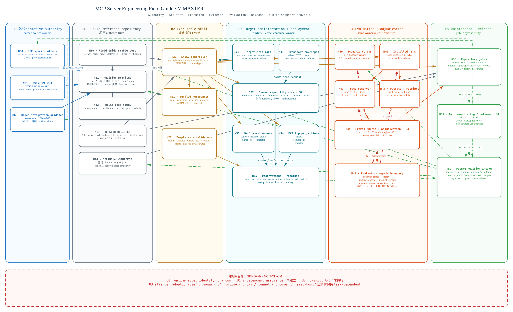
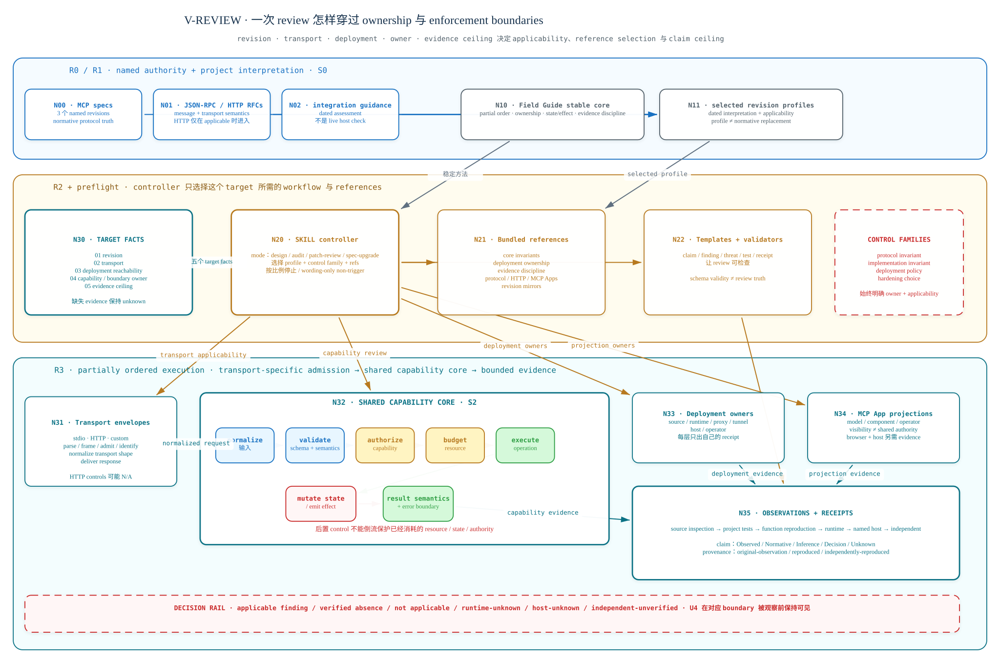
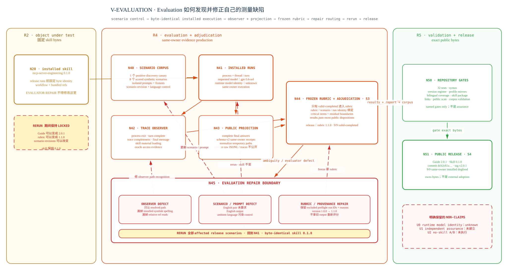

# Architecture atlas

简体中文 · [English](ARCHITECTURE.md)

这份 atlas 是一套受 public evidence boundary 约束的 architecture
reconstruction：它把 Field Guide repository、executable skill、被 review 的
target system、release evaluation 与 Git release object 之间的关系同时摊开。
它不声称一个 repository 拥有整套系统里的全部 truth；它要让真实 owner、version
boundary、evidence ceiling 与 feedback route 同时可见。

图表固定在 public `2.0.1` evidence snapshot：Guide `2.0.1`、skill
`0.1.0`、release commit
`dcb2c61a060948f92d35918af43919bdfde8b01a`、rubric `1.1.0`、一个
discovery canary 与八个 scored synthetic scenarios。Repository 后续变化不会静默
改变这些图所能建立的结论。

## `V-FRONT` — repository front door


`V-FRONT` 用一张 wide editorial view 回答进入 repository 时的第一个问题：指定
external authority，选择 stable method 与 exact profile，确认 target ownership 与
enforcement order，再停在实际 observation 抵达的 evidence ceiling。它保留 semantic
model 中的 `R0–R3`、`S0`、`S2`、`N00/N01/N02/N10/N11/N20/N21/N30–N35` 与
`U4` coordinates，同时有意不展开只有
deep reading 才需要的 evaluation / release planes。它不是 `V-REVIEW` 的 crop，也不
替代 `V-REVIEW`。

## 为什么这套系统需要六个 planes

如果把 `FIELD-GUIDE.md`、`profiles/`、skill、被 review 的 server、evaluation
outputs 与 release tag 当成同一棵平面目录树里的 folders，项目就会被看错。它们的
老化速度不同，permitted writers 也不同。

| Plane | Canonical owner | 跨 boundary 的内容 | 它不能证明什么 |
| --- | --- | --- | --- |
| `R0` External normative authority | MCP specification maintainers、JSON-RPC / HTTP authorities、named integration providers | Named revisions、normative semantics、带日期的 provider guidance | 本 repository 可以重写 external truth |
| `R1` Public reference repository | 本 repository 与 maintainer | Stable method、dated profiles、case evidence、version / bilingual registers | Target runtime state、host acceptance 或 production behavior |
| `R2` Executable skill | Versioned `mcp-server-engineering` skill bytes | Work mode、profile selection、bounded references、templates / validators | Active target 或 runtime 从未暴露的 facts |
| `R3` Target implementation and deployment | Application、parent process、framework、proxy、tunnel、host 与 operators | Source、test、runtime、state/effect、browser、host 与 independent receipts | Source inspection 单独证明 deployed boundary |
| `R4` Evaluation and adjudication | Same-owner release evaluation workflow | Scenario identity、installed run、observer evidence、projected output、rubric disposition | Independent assurance 或 causal no-skill uplift |
| `R5` Maintenance and release | Repository maintainer 与 Git/GitHub release workflow | Validation gates、commit、tag、release、future revision intake | Stranger adoption 或 timeless correctness |



上面的 landscape sibling 用于 repository 与 full-screen inspection；
[native portrait sibling](docs/architecture/architecture-master.zh-CN.svg) 使用同一个
semantic model，服务 continuous document 与 print reading。

Solid route 把被选择的 authority 与 evidence 向前传递；dashed route 把 failure 或新
facts 送回真正能合法修改它们的 artifact。右侧 return lanes 不是装饰：删掉它们，
release 就会看起来像它冻结过的 knowledge 的最终 owner，而不是某一时点的 public
byte identity。

## Canonical state 刻意不是单数

Model 的 stable IDs 区分五类经常被一句 “source of truth” 混在一起的 state。

| State | Canonical owner | Observable receipt |
| --- | --- | --- |
| `S0` normative revision truth | `N00` / `N01` / `N02` external sources | Source URL、revision / assessment date 与 repository dated profile |
| `S1` selected release identities | `N13` `VERSION-REGISTER.json` | Named commit / tag 上经过验证的 register |
| `S2` target runtime state and effects | `N32` capability core 与 `N33` deployment owners | 实际观察到的 source、test、runtime、host 或 independent boundary 上的 evidence |
| `S3` evaluation validity and outcome | `N44` `results.json`，并绑定 scenario、rubric、output 与 receipt | Run ID、projected answer、receipt、adjudication 与 residual boundary |
| `S4` public release byte identity | `N51` Git commit、tag 与 release object | Public commit、tag、release URL 与 read-back |

下游 artifact 不会因为 link 了上游就继承一个更强的 owner。Profile 可以 pin MCP
revision，却不替代 official specification；test 可以观察 function，却不会因此变成
host evidence；Git release 可以 identify bytes，却不证明 independent use。

## 三个 deep semantic views，两套 native layout families

每个 semantic view 都有一张用于 repository / full-screen inspection 的 native
landscape sibling，以及一张用于 continuous document / print reading 的 native
portrait sibling。两者来自同一个 renderer-neutral model，并在 English / 简体中文之间
共用 `R/N/S/E/U` identities。任何 layout 都不是对另一张的 crop、rotation 或 splice，
两套 geometry 也不构成彼此漂移的 semantic truths。

### `V-MASTER` — authority、artifacts、execution、evidence、evaluation、release

Master view 保留六个 regions、26 个 named nodes、五个 canonical states、42 条
directed relationships，以及五个 declared unknowns / non-claims。先自上而下读
forward route，再沿两侧 gutter 追 evaluation repair 与 maintenance intake。

它最重要的区分，是“描述系统的 artifact”和“拥有 runtime state / side effects 的
system”并不相同。`N10` / `N11` 可以 guide 与 pin，`N20` 可以 select workflow；只有
`R3` 中 target-authorized path 可以 execute 或 mutate target state。`N35` 负责记录
observation 实际停在哪里。

### `V-REVIEW` — 一次 review 如何穿过 ownership 与 enforcement boundaries



[打开 native portrait review view。](docs/architecture/review-execution.zh-CN.svg)

Review route 从五个 target facts 开始：revision、transport、deployment
reachability、capability / boundary owner，以及 evidence ceiling。它们决定 profile 与
references；它们不是先选好一张 checklist 后再补写的解释。

Transport-specific envelopes 可以 parse、frame、admit、identify、deliver response，
但所有 transports 最终都进入一个 shared capability core。Core 拥有 normalized
input、semantic validation、authorization-relevant decisions、resource budgets、
execution、state/effect transitions 与 result semantics。这里是 partial order，不是为了
好看才画出的直线顺序：后置 control 不能倒流保护在其 enforcement point 之前已经消耗
的 resource、state 或 authority。

Deployment 与 MCP App projections 随后分叉到各自真正的 owner。Source、runtime、
proxy、tunnel、named host、model projection、component projection 与 operator
projection 彼此相关，却不能互换。每条 route 只贡献自己能产生的 receipt，所以
decision rail 必须保留 `not applicable`、`runtime-unknown`、`host-unknown` 与
`independent-unverified`，不能把它们藏进一个泛化 pass/fail。

### `V-EVALUATION` — evaluation 如何修正自己的 measurement defects



[打开 native portrait evaluation view。](docs/architecture/evaluation-loop.zh-CN.svg)

Release evaluation 把 scenario control、installed execution、trace observation、public
projection 与 frozen-rubric adjudication 分开。只有 `valid-completed` runs 进入 release
rubric。Public outputs 与 schema-v2 same-owner receipts 被公开；raw JSONL、temporary
machine paths 与 tool traces 留在 repository 外。

关键 return route 从 preflight 发现 evaluator defect 开始：observer path recognition
回到 observer；language control 回到 prompt / scenario revision；judgment-contract defect
产生新的 rubric version。随后 affected release scenarios 全部 rerun。被测 skill 仍保持
byte-identical `0.1.0`，所以 evaluator repair 不能被静默写成 skill improvement。

九个 `valid-completed` release runs 通过 critical items 的记录属于 `S3`；repository
gates 再把 exact public bytes 送入 `S4`。任何一步都不会把 same-owner dogfood 转换成
independent assurance。

## Evidence grammar 与 stopping rule

Model 使用两条正交 axes：

- claim type：`Observed`、`Normative`、`Inference`、`Decision` 或 `Unknown`；
- provenance：`original-observation`、`reproduced` 或
  `independently-reproduced`。

Evidence ladder 是 source inspection → project-local test → function-level
reproduction → runtime observation → named-host acceptance → independent
reproduction。Receipt 只说明真正抵达了哪一层；把 receipt sanitize 或 publish 并不会
升级 provenance。

Evidence 无法跨过哪一层，就停在哪里。Control 不属于 selected transport / owner 时写
`not applicable`；control 可能相关，但 runtime、host、browser、proxy、tunnel 或
independent evidence 缺失时写 `unknown`。

## 明确保留的 unknowns 与 non-claims

- `U0` — runtime 没有报告比 requested `gpt-5.6-sol` label 更具体的 model identity；
- `U1` — release `2.0.1` 没有建立 independent assurance；
- `U2` — 没有执行 causal no-skill A/B comparison；
- `U3` — public evidence 尚未建立 unfamiliar independent maintainers 会怎样 adopt 或
  operationalize 本项目；
- `U4` — target runtime、proxy、tunnel、browser 与 named-host behavior 在对应 boundary
  被真正观察前保持 task-dependent。

它们本身就是 architecture 的一部分。删掉它们不是把同一系统画得更简单，而是画成
一个更强、也更不诚实的系统。

## Bilingual、editable 与 multi-layout source contract

### Repository front door · native wide SVG

| View | English publication/source SVG | 简体中文 publication/source SVG | Semantic authority |
| --- | --- | --- | --- |
| `V-FRONT` | [`field-guide-front-door.en.svg`](docs/architecture/field-guide-front-door.en.svg) | [`field-guide-front-door.zh-CN.svg`](docs/architecture/field-guide-front-door.zh-CN.svg) | [`architecture-model.json`](docs/architecture/architecture-model.json) |

### Portrait · continuous document 与 print reading

| View | English publication SVG | 简体中文 publication SVG | Editable sources |
| --- | --- | --- | --- |
| `V-MASTER` | [`architecture-master.en.svg`](docs/architecture/architecture-master.en.svg) | [`architecture-master.zh-CN.svg`](docs/architecture/architecture-master.zh-CN.svg) | [English](docs/architecture/architecture-master.en.excalidraw) · [简体中文](docs/architecture/architecture-master.zh-CN.excalidraw) |
| `V-REVIEW` | [`review-execution.en.svg`](docs/architecture/review-execution.en.svg) | [`review-execution.zh-CN.svg`](docs/architecture/review-execution.zh-CN.svg) | [English](docs/architecture/review-execution.en.excalidraw) · [简体中文](docs/architecture/review-execution.zh-CN.excalidraw) |
| `V-EVALUATION` | [`evaluation-loop.en.svg`](docs/architecture/evaluation-loop.en.svg) | [`evaluation-loop.zh-CN.svg`](docs/architecture/evaluation-loop.zh-CN.svg) | [English](docs/architecture/evaluation-loop.en.excalidraw) · [简体中文](docs/architecture/evaluation-loop.zh-CN.excalidraw) |

### Landscape · repository 与 full-screen inspection

| View | English publication SVG | 简体中文 publication SVG | Editable sources |
| --- | --- | --- | --- |
| `V-MASTER` | [`architecture-master.landscape.en.svg`](docs/architecture/architecture-master.landscape.en.svg) | [`architecture-master.landscape.zh-CN.svg`](docs/architecture/architecture-master.landscape.zh-CN.svg) | [English](docs/architecture/architecture-master.landscape.en.excalidraw) · [简体中文](docs/architecture/architecture-master.landscape.zh-CN.excalidraw) |
| `V-REVIEW` | [`review-execution.landscape.en.svg`](docs/architecture/review-execution.landscape.en.svg) | [`review-execution.landscape.zh-CN.svg`](docs/architecture/review-execution.landscape.zh-CN.svg) | [English](docs/architecture/review-execution.landscape.en.excalidraw) · [简体中文](docs/architecture/review-execution.landscape.zh-CN.excalidraw) |
| `V-EVALUATION` | [`evaluation-loop.landscape.en.svg`](docs/architecture/evaluation-loop.landscape.en.svg) | [`evaluation-loop.landscape.zh-CN.svg`](docs/architecture/evaluation-loop.landscape.zh-CN.svg) | [English](docs/architecture/evaluation-loop.landscape.en.excalidraw) · [简体中文](docs/architecture/evaluation-loop.landscape.zh-CN.excalidraw) |

[`architecture-model.json`](docs/architecture/architecture-model.json) 拥有 semantic
regions、nodes、states、edges、unknowns、selected views 与 render contract。三组 deep
views 由 `.excalidraw` files 拥有 editable geometry 与 connector bindings，SVG 是
publication projections；两张 `V-FRONT` SVG 直接拥有 native wide geometry 与
publication bytes，并保持 self-contained、script-free 与 language-paired。所有 views
都使用 serif / Song semantic copy 与 mono coordinates。

English 与 Chinese 是 language siblings；portrait 与 landscape 是 layout siblings。
任何 canvas 都不把两种语言硬堆在一起，也不把其中一种语言降成另一种语言旁边的一行
tiny annotation。Labels 可以 naturalize，geometry 可以按 form factor 重组，但 stable
IDs、versions、owners、edge meanings、evidence status 与 unknowns 必须对齐。

## Rebuild 与 maintenance

从 repository root 运行 deep-atlas architecture pipeline：

```bash
python3 tools/architecture/prepare_bilingual_architecture_scenes.py
python3 tools/architecture/layout_portrait_architecture_scenes.py
python3 tools/architecture/render_architecture_svgs.py
```

Owner、boundary、state、edge、evidence status 或 declared unknown 改变时，先改 model；
`prepare_bilingual_architecture_scenes.py` 同步两套 layout families；
`layout_portrait_architecture_scenes.py` 只拥有 portrait geometry；checked-in landscape
scenes 保留 deliberate wide geometry。Semantics 不变而只调整版式时，才只改 scene
geometry。问题真正改变时才从 model 新建独立 view，不能通过 crop、rotate 或 splice
现有 canvas 制造它。

`V-FRONT` 是 native-SVG source/publication pair，不是 Excalidraw projection。Semantic
model 改变后，必须同步两个 language siblings，验证 XML，拒绝 script、
`foreignObject` 与 external-asset dependencies，并在真实 browser 中检查 1600×900 和
README width 两种尺度。

发布更新前，核验两种语言与所有 declared layout families，重新 render 十二张 deep-atlas
SVG，再把它们与两张 `V-FRONT` SVG 一起在各自 intended reading scale 逐张检查；随后运行
repository 的 bilingual、link、public-text 与 test gates，并把变化记录到 `Unreleased`。
新的 specification 或 integration fact 进入 future revision intake；它不授权重写
historical profiles 或旧 release evidence。

## Public evidence routes

- [Field Guide stable core](FIELD-GUIDE.zh-CN.md)
- [Version register](VERSION-REGISTER.json)
- [Originating public case study](case-studies/gpt-thinking-block-mcp/CASE-STUDY.zh-CN.md)
- [Installed-skill dogfood report](evaluations/skill-v0.1.0/REPORT.zh-CN.md)
- [Machine-readable adjudication](evaluations/skill-v0.1.0/results.json)
- [Release `v2.0.1`](https://github.com/IndelibleVivi/mcp-server-engineering-field-guide/releases/tag/v2.0.1)

Architecture model 与 diagrams 作为 project documentation，使用
[CC BY 4.0](LICENSING.md)；`tools/architecture/` 中的 rebuild scripts 使用
Apache-2.0。
