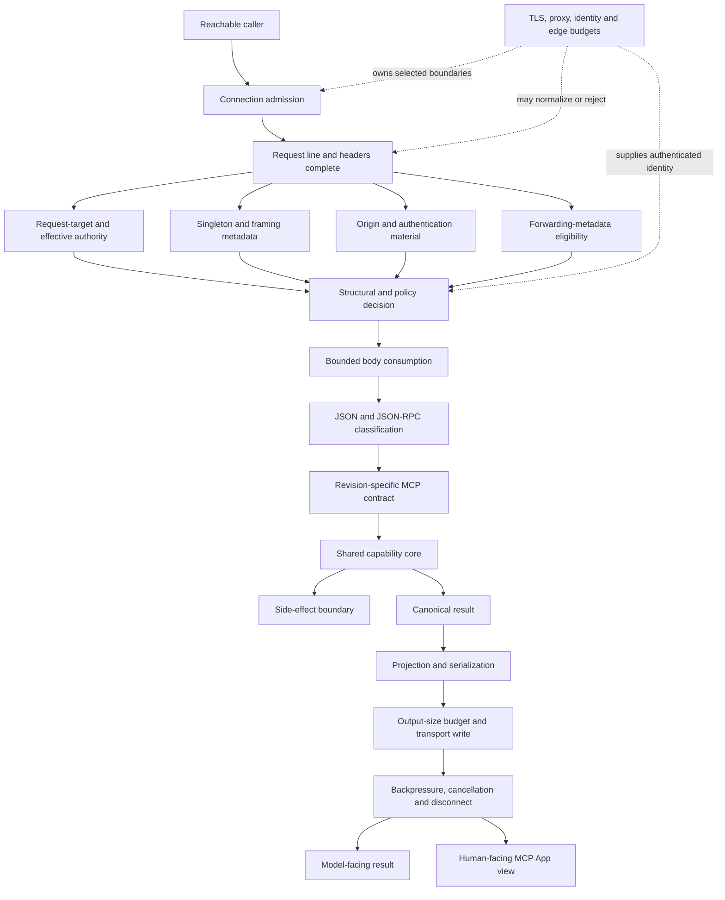

# MCP Server Engineering Field Guide

Version: `2.0.0`<br>
Stable core: `2`<br>
Language peer: [中文](FIELD-GUIDE.zh-CN.md)<br>
Revision authority: [VERSION-REGISTER.json](VERSION-REGISTER.json)

This guide is a revision-aware method for designing, auditing, testing, and operating MCP servers and MCP Apps. It separates stable engineering invariants from protocol rules that change between MCP revisions and host integrations that change without a protocol revision.

The guide does not certify a server, replace a threat model, or turn every example control into a universal requirement. Its job is to make claims falsifiable, ownership explicit, and version drift visible.

---

## 1. The central model: a partially ordered capability boundary

An MCP server exposes one or more capabilities through a protocol and transport. The boundaries are partially ordered: some checks can run independently after headers are available, while other work must wait until structural and policy gates complete.



The durable rule is:

> **A control cannot retroactively protect resources, state, or authority already consumed before its enforcement point.**

Examples:

- a tool-call limiter cannot bound connections stalled in header parsing;
- an Origin or authentication gate cannot recover parser resources already consumed before the gate runs;
- a file mode cannot revoke old copies, backups, or data already read;
- a successful capability result cannot make an earlier side effect idempotent after response delivery fails.

### 1.1 Classify controls before adopting them

| Class | Meaning | Examples |
|---|---|---|
| Stable capability/protocol invariant | Applies across transports and revisions unless a profile explicitly changes it | exact classification, honest metadata, shared domain validation, bounded side effects |
| Transport-conditional | Exists because of a selected transport | HTTP framing, Host, Origin, CORS, request-target parsing, body deadlines |
| Deployment-conditional | Depends on real reachability and edge ownership | TLS, OAuth, proxy trust, connection limits, per-principal quotas |
| Product-specific | Exists only because the product includes the feature | capture, REST mirrors, widgets, persistent application state, OpenAPI |

Do not copy an HTTP hardening patch into a parent-owned stdio server merely because both are MCP servers. Do not delete an HTTP control from a browser-accessible loopback server merely because the product is “local.”

---

## 2. Evidence discipline

Every consequential statement should carry one evidence class:

- **Observed** — directly present in a pinned source tree, diff, test output, runtime probe, log, or receipt.
- **Normative** — required or constrained by a named primary specification and revision.
- **Inference** — engineering judgment derived from evidence and a stated threat model.
- **Decision** — project-owned product or architecture scope.
- **Unknown** — evidence needed to decide the claim does not yet exist.

Do not promote claims between classes silently.

```text
variable name: trust_proxy                     → Observed
immediate peer is authenticated as that proxy → Unknown until enforced/proved
reviewer says it is safe                       → Observed reviewer statement
runtime property is safe                       → still requires proof
```

For each control or finding, answer seven questions:

1. What invariant must remain true?
2. What concrete failure occurs when it is false?
3. Under which transport, revision, and deployment does it apply?
4. Which layer owns enforcement?
5. What is the narrow implementation pattern?
6. What test or observation could falsify the claim?
7. What residual boundary remains after that proof?

### 2.1 Receipt provenance

Use distinct receipt states:

- `original-observation`: evidence existed earlier; the receipt was recorded later;
- `reproduced`: the observation was executed again while recording the receipt;
- `independently-reproduced`: another execution owner reproduced it independently.

Assigning a receipt ID after an event must not manufacture a contemporaneous artifact. Record both `executed_at` and `recorded_at`, plus a typed immutable source identity, environment, command or probe, parameters, expected and actual observables, exit status, execution owner and owner relationship, independence basis, representation and omitted-material disclosure, and residual boundary. `independently-reproduced` is valid if and only if `independent_execution` is true; sanitization or projection never changes that provenance.

---

## 3. Capability and threat model before transport

Define the capability before choosing an MCP envelope:

- accepted inputs and structural/semantic limits;
- model-facing output and human-facing output;
- filesystem, network, subprocess, database, browser, or account effects;
- idempotency and retry behavior;
- authority and caller identity;
- CPU, memory, connection, disk, and downstream quotas;
- state that must persist and data that must never be retained.

### 3.1 Transport selection

| Deployment | Typical transport | Primary new boundaries |
|---|---|---|
| Parent launches one local server | stdio | process ownership, environment, pipe framing, stdout purity |
| Multiple local processes | Unix socket or loopback HTTP | local peer reachability and OS ownership; HTTP parser if selected |
| Browser to local service | loopback HTTP | DNS rebinding, Host, Origin, CORS, local ambient authority |
| One operator across machines | remote HTTP behind a controlled edge | TLS, authentication, proxy trust, connection/parser budgets |
| Multiple users or tenants | identity-capable remote stack | login, token lifecycle, authorization, tenancy, audit, distributed quota |

Decision rules:

- Prefer stdio when the host can launch and own the server.
- Prefer a Unix socket when local multiprocess access is required but browser/HTTP interoperability is not.
- Use loopback HTTP when its interoperability justifies the parser and browser boundary.
- Use remote HTTP only after naming the owners of TLS, identity, connection admission, header limits, and operations.
- Treat a global static bearer as a bounded single-operator gate, not an OAuth or tenancy system.

---

## 4. Revision-specific protocol truthfulness

Protocol truthfulness is stable; the exact rules live in a selected profile.

Before implementation or review:

1. Pin the source revision.
2. Identify the declared MCP revision.
3. Load only that [MCP profile](profiles/README.md).
4. Keep generic JSON-RPC rules separate from MCP's revision-specific narrowing.
5. Do not apply the current revision retroactively to a historical server.

Stable requirements:

- classify request, notification, result response, error response, and invalid/mixed shapes exactly;
- ensure only a valid request can reach a capability;
- advertise only implemented capabilities, sessions, streams, extensions, and effects;
- separate transport failures from protocol-envelope failures;
- bind compatibility claims to an actual revision and tested hosts.

### 4.1 Version drift is an engineering input

MCP changed batching, lifecycle, sessions, discovery, routing headers, result envelopes, streaming, caching, and extensions across recent revisions. Therefore write:

```text
Under MCP 2025-06-18, this server rejects top-level batches.
Under MCP 2026-07-28, each request is self-describing and no initialize handshake exists.
Stable inference: a server must implement and test the contract of the revision it declares.
```

Do not write unqualified “MCP requires X” when X is profile-specific.

### 4.2 Metadata is part of the contract

- Side-effect annotations must match runtime effects.
- Authentication metadata must match the transport's actual access mode.
- A host-specific UI bridge must not be advertised as portable MCP Apps interoperability.
- A session identifier must not be emitted without real session ownership in revisions that define sessions.
- Deprecated or removed capabilities must be handled according to the selected revision and migration policy.

Metadata is not enforcement, but hosts, models, and users may rely on it for consent, routing, rendering, and policy.

---

## 5. HTTP parsing and resource budgets

This section applies only when HTTP is part of the selected transport.

### 5.1 Name each time budget

| Budget | Begins | Ends | Protects |
|---|---|---|---|
| Header deadline | accept or first request byte | complete header terminator | connection, parser and worker occupancy |
| Body deadline | headers complete | exact declared body consumed | slow body trickle and handler occupancy |
| Whole-request deadline | accept | request accepted or rejected | total client-controlled request lifetime |
| Handler deadline | capability dispatch | completion or cancellation | application and downstream work |
| Egress deadline | first response write | delivery, cancellation or disconnect | output buffers and slow readers |

A renewable socket idle timeout is not an absolute deadline.

### 5.2 Separate header metadata from body consumption

After the request line and headers are complete, derive and validate:

- request-target form and effective authority;
- duplicate or malformed singleton fields;
- `Transfer-Encoding` / `Content-Length` framing metadata;
- Origin and credential material;
- whether forwarding metadata is eligible to influence interpretation.

Only after the required structural and policy decision should the server consume a bounded body. The precise ordering among header-derived checks may vary, but large or unbounded body consumption must not occur accidentally before the intended gate.

### 5.3 Unambiguous framing

For a low-level HTTP/1.1 server:

- reject unsupported transfer codings;
- reject `Transfer-Encoding` combined with `Content-Length`;
- reject duplicate or malformed singleton framing fields;
- bound the decimal representation before expensive numeric conversion;
- bound the declared length before allocation/read;
- require the expected media type;
- consume exactly the declared bytes under an absolute body deadline;
- close when unread or ambiguous bytes make connection reuse unsafe.

Behind a mature framework or reverse proxy, verify which layer owns normalization and rejection. Do not create a second raw parser whose interpretation can diverge from the edge.

### 5.4 Request-target and effective authority

Host policy must be evaluated against HTTP's effective authority, not a convenient header alone.

- origin-form uses the valid Host authority;
- absolute-form uses the request-target authority;
- unsupported authority-form or asterisk-form must be rejected or deliberately implemented;
- malformed/missing/duplicate Host is a structural `400` class;
- syntactically valid but disallowed authority is a policy `403` class.

Cache parsed request metadata using every input that affects the result. Keep-alive processing can expose stale cache keys that unit tests on one request never see.

### 5.5 Pre-dispatch framework behavior

Inspect what the server/framework does before the method handler:

- request-line and header parsing;
- `Expect: 100-continue`;
- normalization and duplicate handling;
- thread/worker creation;
- request size and timeout enforcement.

Inspect post-dispatch behavior as well:

- serialization;
- connection reuse;
- response write errors;
- streaming and cancellation;
- default traceback/logging behavior.

Application guards cannot protect work already performed by these framework stages.

### 5.6 Admission before capability limiting

Distinguish four budgets:

1. live connections;
2. parser bytes and time;
3. parsed request throughput;
4. capability operations and side effects.

An in-memory tool limiter usually covers only the fourth budget. A bounded worker pool still needs an absolute header deadline or slow clients can occupy every worker within the bound.

---

## 6. Separate trust and identity boundaries

| Boundary | Question answered | Does not prove |
|---|---|---|
| Listener bind | Which interfaces can accept a connection? | caller identity |
| Effective authority / Host | Which HTTP authority is addressed? | browser origin or principal |
| Origin | Which browser origin initiated the request? | non-browser identity |
| CORS | May browser code read/use the response? | server-side authorization |
| Authentication | Does the caller present an accepted credential? | permission for every capability |
| Authorization | May this principal perform this action? | bounded parsing or safe framing |
| Proxy trust | May forwarding metadata affect interpretation? | end-user identity by itself |
| Public base URL | What canonical external URL is advertised? | route used by this request |
| TLS | Is a network hop confidential and authenticated? | application permission |

### 6.1 Proxy trust requires an enforceable owner

A Boolean called `trust_proxy` does not authenticate the peer. If an untrusted caller can reach the backend directly, attacker-supplied forwarding metadata remains untrusted even when syntactically valid.

Valid ownership patterns include:

- private network policy plus header replacement;
- Unix socket ownership;
- mTLS or an authenticated proxy-to-backend hop;
- explicit peer validation for a fixed, documented topology.

Define one forwarding-chain model and reject ambiguity. Keep public URL derivation separate from caller authentication.

### 6.2 Authentication claims must name the model

State whether the server uses:

- no transport authentication within a parent-owned stdio boundary;
- a static shared bearer;
- OAuth/OIDC with a named MCP revision and host flow;
- mTLS or gateway-issued identity;
- per-principal authorization beyond authentication.

Do not label a static shared secret as OAuth or claim multi-user isolation from a global credential.

---

## 7. One capability core, transport-specific envelopes

When MCP, REST, CLI, or another adapter exposes the same operation, share:

- domain input schema and normalization;
- semantic size limits;
- capability authorization and budget;
- side-effect decision;
- canonical result.

Keep transport-specific:

- HTTP status and JSON-RPC error mapping;
- JSON-RPC IDs;
- CORS and HTTP headers;
- OpenAPI and MCP metadata projections;
- retry and delivery semantics.

Cross-adapter verification should send the same domain corpus through every route and compare normalized outcome, budget consumption, and effects. Only the intended envelope may differ.

---

## 8. Concurrency, state, and side effects

Locks protect shared-state invariants; they do not bound concurrency.

| Mechanism | Effective scope | Important limitation |
|---|---|---|
| in-memory lock | one process | disappears on restart; no cross-process coordination |
| in-memory limiter | one process | counters reset; no per-user fairness unless identity exists |
| file/advisory lock | cooperating writers | depends on every writer and filesystem behavior |
| external store/queue | configured deployment | adds its own durability, availability and consistency contract |

### 8.1 Side-effect honesty

For capture or any durable effect:

- default to off unless the product requires it;
- declare the effect in metadata and docs;
- protect path ownership, parent directories, files, backups and retention;
- serialize writes at the scope actually used;
- keep sensitive content out of default logs;
- test failure without corrupting the protocol result;
- delete the surface when the feature has no product value.

### 8.2 Idempotency and operation identity

Mutation tools need an answer to “what happens after an ambiguous delivery failure?” Options include:

- naturally idempotent operations;
- client-supplied or server-minted operation keys;
- compare-and-set/version preconditions;
- explicit status/query operations;
- documented no-automatic-retry behavior.

Do not solve this with hidden transport sessions unless the selected protocol profile and product actually require them.

---

## 9. Egress is an independent boundary

A valid capability result still has to survive projection, serialization, output limits, transport write, backpressure, cancellation, and disconnect.

```text
side effect committed
→ serialization or write fails
→ caller cannot identify whether the effect happened
→ retry may duplicate the effect
```

Egress requirements:

- bound serialized output independently of input budgets;
- define streaming buffers and slow-reader behavior;
- define whether disconnect means cancellation;
- separate expected client disconnects from unexpected application faults;
- avoid raw tracebacks or sensitive result data in default logs;
- test partial writes and delivery failure after side-effect commit;
- preserve a stable result/effect identity where retry ambiguity exists.

---

## 10. MCP Apps serve two interactive consumers through multiple projections

An MCP App has two simultaneous interactive consumers and more than two output projections:

- the assistant/model receives tool metadata, model content and structured results;
- the human receives and interacts with a web view through a host bridge.

Keep explicit projections for:

- model-visible content;
- structured content shared with model/view as intended;
- HTML/JS/CSS resources, CSP, permissions and bridge metadata;
- host-specific extensions and compatibility aliases.

Do not let a view enforce authorization that belongs on the server. Do not assume content invisible in the card is invisible to the model. Bind portability claims to the implemented bridge and tested hosts.

When view code or bridge behavior changes, consider resource version/cache identity, CSP, error states, layout/theme/device behavior, follow-up interaction, and useful fallback for clients that do not render the view.

Use the dated [integration guidance profile](profiles/integration-guidance-2026-08-15.md) rather than treating host behavior as a frozen protocol rule.

---

## 11. Deployment layers

Keep these surfaces separate:

1. direct-run application bind;
2. listener inside a container or sandbox namespace;
3. host-side port publication;
4. proxy/tunnel listener and authentication;
5. firewall/private-network reachability;
6. actual client acceptance.

Container-internal `0.0.0.0` can coexist with host-loopback publication. A loopback backend can still be publicly reachable through a proxy. Source configuration cannot prove runtime topology.

### 11.1 Static review versus runtime proof

Static deployment files can show intended configuration. Runtime verification is required for:

- effective listener and publication addresses;
- process UID/GID and container capabilities;
- mounted volume ownership and permissions;
- healthcheck behavior with authentication enabled;
- reachability from host, sibling container and external namespace;
- forwarding-header replacement and direct-backend denial;
- signal handling and graceful shutdown;
- secret exposure in process args, inspection output or logs.

For an untrusted-network edge, explicitly own absolute header timeout, aggregate header bytes, active connections, per-source budgets, body limits, upstream timeouts, header replacement and bounded logs.

---

## 12. Documentation is an executable contract

Users and agents deploy what the documentation causes them to believe.

| Claim | Minimum proof | Residual qualifier |
|---|---|---|
| revision-compatible | profile-specific conformance/interoperability tests | named revision and unsupported features |
| rate-limited | cross-route and concurrent tests | process/principal/parser scope |
| request timeout | raw header/body probes | exact phase with an absolute deadline |
| proxy-aware | trust-chain and topology proof | whether peer identity is enforced or delegated |
| authenticated | challenge, metadata and actual-client test | shared token versus OAuth/principal identity |
| portable MCP App | standard bridge and claimed-host tests | compatibility aliases and untested hosts |
| Docker tested | build/run/inspect/health/stop | platform and topology tested |
| capture protected | path/mode/concurrency/failure tests | backup, retention and multi-process assumptions |

Avoid umbrella claims such as “fully MCP compliant,” “production secure,” or “DoS hardened” without a bounded, revision-specific assurance definition.

“Example code” is a scope label, not a mechanism. Runnable listeners and deployment instructions create a real implementation contract even when transport engineering is not the project's teaching focus.

---

## 13. Verification and independent review

### 13.1 Verification layers

| Layer | High-value evidence |
|---|---|
| Pure capability | semantic boundaries, effects, idempotency |
| Protocol profile | exact message shapes, revision differences, extension negotiation |
| HTTP handler | framing, media type, body limits, status/close behavior |
| Raw socket | Host/target forms, TE+CL, slow headers/body, keep-alive, Expect |
| Concurrency | shared budgets, lock scope, thread/FD/RSS growth, latency under slow clients |
| Egress | serialization limits, slow reader, disconnect, partial delivery, retry ambiguity |
| Real process | bind, logs, files, defaults, shutdown |
| Proxy/container | namespaces, header replacement, auth, UID/volume, health |
| Host interoperability | actual initialization/discovery, calls, auth and view behavior |
| Public CI | reproducible clean revision and supported runtime matrix |

For every rejection, assert not only status/error but also capability non-execution, unchanged side effects, connection behavior, CORS, log content, and next-request isolation.

### 13.2 Review as orthogonal instrumentation

Independent review should attack different assumptions:

- wire/protocol composition;
- deployment, identity and documentation truthfulness;
- framework pre-dispatch and post-dispatch behavior;
- concurrency/resource ownership;
- human-facing host interoperability;
- evidence/provenance quality.

Reviewer duration, model name, test count and confidence are not assurance levels. Treat findings as hypotheses, reproduce them, check normative claims against primary sources, and record disagreements.

### 13.3 Review-bundle integrity

Prefer pinned public revisions or strict-UTF-8 source bundles. Preserve the producer copy until review completes. Detect truncation, NUL bytes, replacement characters, private paths and credential indicators. A binary archive corrupted by text transcoding cannot be reconstructed from visible filenames; stop and fall back to a clean authority.

---

## 14. Protocol-profile maintenance

When a new MCP revision appears:

```text
freeze existing profile
→ add a new profile
→ compare normative sources
→ load source and target profiles for upgrades
→ identify affected code paths and claims
→ inventory retained, replaced and retired paths
→ identify invalidated and new tests
→ update compatibility matrix
→ update skill routing
→ synchronize and byte-bind skill profile mirrors
→ retain historical tests for historical servers
```

Each profile records:

- normative source and revision;
- assessment date;
- message/lifecycle/transport consequences;
- implementation and migration impact;
- revision-specific tests;
- deprecated/removed behavior;
- interoperability unknowns.

For a revision upgrade, inventory routes/methods, headers, state stores, background tasks, compatibility adapters, fixtures, documentation claims, and deployment configuration. A passing target request is not evidence that the superseded source-era path has been retired.

Moving host and integration guidance uses an assessment date, not a fabricated protocol version.

---

## 15. Anti-cargo-cult architecture table

| Situation | Keep | Delete or delegate |
|---|---|---|
| Parent-owned stdio | classifier, capability validation, truthful metadata, stdout purity | Host, Origin, CORS, HTTP framing and proxy logic |
| Unix socket | capability/protocol core and OS ownership | browser/Host/CORS controls unless an HTTP layer remains |
| Browser-accessible loopback HTTP | Host/effective authority, Origin, CORS, HTTP budgets, local auth decision | public OAuth unless public identity is required |
| Remote backend behind a verified edge | application semantics, body/JSON limits, shared capability, egress | TLS/header deadlines/connection caps may be edge-owned when proved |
| Remote multi-user service | strict protocol, real identity/authz, per-principal budgets | global bearer and process-local limiter as identity/quota claims |
| Product without capture | truthful no-write contract | capture config, paths, locks and retention surface |
| Historical revision server | profile-bound implementation and tests | current-revision rules applied retroactively |
| Mature SDK/framework | domain invariants and composition tests | duplicate hand-written parser/lifecycle behavior already owned and verified |

Before adopting a control, ask which failure exists, who already owns it, how ownership was proved, whether duplication creates divergent interpretations, and what maintenance burden follows.

---

## 16. Delivery workflow

### Design

- Define capability, effects, authority, idempotency and budgets.
- Select transport from actual reachability.
- Pin the protocol profile and claimed hosts.
- Draw parser, identity, side-effect and egress ownership.
- Record explicit non-goals and unknowns.

### Implement

- Build the shared domain capability first.
- Add exact profile-specific classification.
- Add adapters without duplicating domain authority.
- Make side effects opt-in and metadata-truthful.
- Add only controls owned by this deployment or explicitly delegated to a verified edge.

### Pre-release

- Run domain, profile, transport, raw-socket, concurrency and egress tests.
- Exercise keep-alive and cache-key changes across sequential requests.
- Smoke a real process and inspect listeners, logs and files.
- Test actual claimed clients/hosts.
- Produce receipts and scan the public diff for secrets, private paths and raw evidence.

### Deploy and operate

- Verify actual topology and identity flow.
- Verify proxy/header/connection budgets and direct-backend denial.
- Verify runtime user, volume, health and shutdown.
- Track profile and host-guidance changes.
- Remove superseded paths instead of retaining dead compatibility code without a current caller.

---

## 17. Ten questions before shipping

1. What exact capability can a valid request cause, and where is its one canonical authority?
2. Which callers can reach the real transport?
3. Which MCP revision, extensions and hosts are claimed?
4. Before authentication or capability limiting runs, what sockets, workers, bytes and time can one caller consume?
5. Who owns request-line, headers, body, deadlines and admission, and how was that proved?
6. Are Host, Origin, CORS, authentication, authorization, proxy trust and advertised URL separate decisions?
7. Do all adapters share validation, budgets and effects without conflating transport errors?
8. Do metadata, docs, auth declarations and UI bridge claims match every runtime mode?
9. What happens after side-effect commit if serialization, write, streaming or delivery fails?
10. Which claims are Observed, Normative, Inference, Decision or Unknown, and what evidence would change them?

If the answer is “MCP handles it,” “the proxy probably handles it,” or “an agent will fix it later,” the ownership map is incomplete.

---

## 18. References

- [Versioned protocol profiles](profiles/README.md)
- [Case studies](case-studies/)
- [JSON-RPC 2.0](https://www.jsonrpc.org/specification)
- [RFC 9110](https://www.rfc-editor.org/rfc/rfc9110.html)
- [RFC 9112](https://www.rfc-editor.org/rfc/rfc9112.html)
- [MCP specifications](https://modelcontextprotocol.io/specification/)
- [MCP Apps](https://modelcontextprotocol.io/extensions/apps/overview)

This guide remains subordinate to current source, pinned primary specifications, reproduced behavior, and the explicit product/deployment contract.
