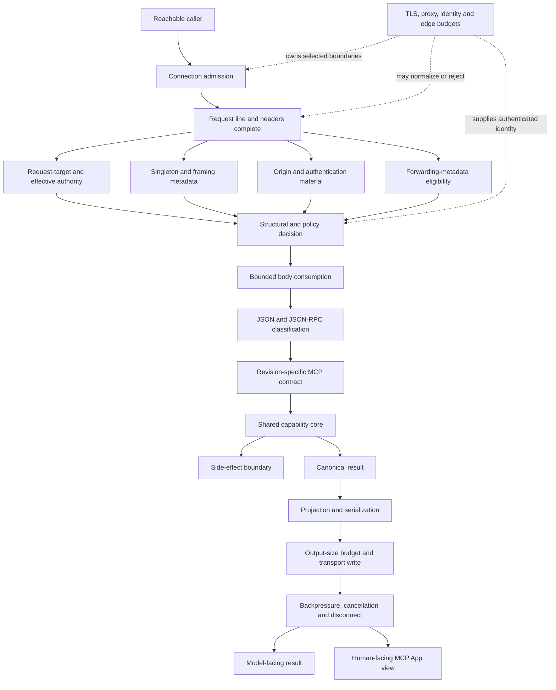

# MCP Server Engineering Field Guide（中文版）

版本：`2.0.0`<br>
Stable core：`2`<br>
Language peer：[English](FIELD-GUIDE.md)<br>
Revision authority：[VERSION-REGISTER.json](VERSION-REGISTER.json)

这是一套 revision-aware 的 MCP server / MCP App 设计、审查、测试与维护方法。它把长期稳定的 engineering invariants、会随 MCP revision 改变的 normative contract，以及可能不经协议升级就变化的 host integration guidance 分开管理。

本文不会替任何 server 发放“安全认证”，也不会把案例中的每个 control 变成 universal requirement。它要做的是让 claim 可证伪、ownership 可定位、version drift 可见。

---

## 1. 中央模型：partially ordered capability boundary

MCP server 通过 protocol 与 transport 暴露一项或多项 capability。各 boundary 是 partial order：headers 完成后，一些检查可以独立进行；另一些工作则必须等 structural/policy gates 结束后才可开始。



可迁移的核心 rule 是：

> **一个 control 无法事后保护在其 enforcement point 之前已经被消耗的 resources、state 或 authority。**

例如：

- tool-call limiter 无法限制卡在 header parsing 阶段的 connections；
- Origin/auth gate 无法收回在 gate 运行前已经消耗的 parser resources；
- file mode 无法撤销旧副本、backup 或已经发生的读取；
- capability 成功返回也无法让一次已发生的 side effect 在 delivery failure 后自动具备 idempotency。

### 1.1 采用 control 前先分类

| 类别 | 含义 | 例子 |
|---|---|---|
| Stable capability/protocol invariant | 跨 transport/revision 通常成立，除非 profile 明确改变 | exact classification、honest metadata、shared domain validation、bounded side effects |
| Transport-conditional | 因选用了某种 transport 才存在 | HTTP framing、Host、Origin、CORS、request-target、body deadline |
| Deployment-conditional | 取决于真实 reachability 与 edge ownership | TLS、OAuth、proxy trust、connection limits、per-principal quota |
| Product-specific | 只有产品选择该 feature 才存在 | capture、REST mirror、widget、application state、OpenAPI |

不要因为两个项目都叫 MCP server，就把 HTTP hardening 机械复制进 parent-owned stdio server；也不要因为产品被称为“本地工具”，就从 browser-accessible loopback HTTP 中删掉 Host/Origin 等真实 boundary。

---

## 2. Evidence discipline

每条 consequential claim 都应属于一种 evidence class：

- **Observed** — 直接存在于 pinned source、diff、test output、runtime probe、log 或 receipt 中；
- **Normative** — 由具名 primary specification 与 revision 要求或约束；
- **Inference** — 根据 evidence 和明确 threat model 作出的工程判断；
- **Decision** — 项目自己选择的 product/architecture scope；
- **Unknown** — 当前缺少能作出判断的 evidence。

不得默默把 claim 从一种 evidence class 升级到另一种：

```text
变量名是 trust_proxy                         → Observed
immediate peer 确实被认证为那个 proxy       → 未实施/未证明前仍是 Unknown
reviewer 说它安全                           → Observed reviewer statement
runtime property 确实安全                   → 仍需独立 proof
```

审查每个 control/finding 时回答七个问题：

1. 必须保持什么 invariant？
2. invariant 失效会产生什么具体 failure？
3. 它适用于什么 transport、revision 与 deployment？
4. 哪一层真正拥有 enforcement？
5. 最窄的 implementation pattern 是什么？
6. 哪个 test/observation 能推翻这条 claim？
7. proof 之后仍有哪些 residual boundaries？

### 2.1 Receipt provenance

Receipt status 必须分开：

- `original-observation`：evidence 早已执行，receipt 后补；
- `reproduced`：为记录 receipt 又重新执行了一次；
- `independently-reproduced`：另一 execution owner 独立复现。

事后给 observation 编号，不得伪造 contemporaneous evidence。Receipt 至少记录 `executed_at`、`recorded_at`、typed immutable source identity、environment、command/probe、parameters、expected/actual observables、exit status、execution owner 与 owner relationship、independence basis、representation 与 omitted-material disclosure，以及 residual boundary。只有 `independent_execution` 为 true 时 status 才能是 `independently-reproduced`，反之亦然；sanitization/projection 不会改变该 provenance。

---

## 3. 先定义 capability / threat model，再选 transport

写 MCP envelope 以前先回答：

- 接受什么 inputs，以及 structural/semantic limits；
- model-facing 与 human-facing outputs 分别是什么；
- 是否触及 filesystem、network、subprocess、database、browser 或 account；
- idempotency 与 retry 行为；
- authority 与 caller identity；
- CPU、memory、connection、disk 与 downstream quota；
- 什么 state 必须持久化，什么 data 不应被保存。

### 3.1 Transport selection

| Deployment | 常见 transport | 新增的主要 boundary |
|---|---|---|
| Parent 启动单个本地 server | stdio | process ownership、environment、pipe framing、stdout purity |
| 多个本地 process | Unix socket 或 loopback HTTP | local peer reachability / OS ownership；若为 HTTP 则还包括 parser |
| Browser 调用本地 service | loopback HTTP | DNS rebinding、Host、Origin、CORS、local ambient authority |
| 单 operator 跨机器使用 | controlled edge 后的 remote HTTP | TLS、authentication、proxy trust、connection/parser budget |
| 多用户或多 tenant | identity-capable remote stack | login、token lifecycle、authorization、tenancy、audit、distributed quota |

Decision rules：

- host 能 launch/own server 时优先 stdio；
- 需要本地多 process，但不需要 browser/HTTP interop 时优先 Unix socket；
- 只有 HTTP interoperability 的收益足以覆盖 parser/browser boundary 时才选 loopback HTTP；
- remote HTTP 必须先说清 TLS、identity、connection admission、header limits 与 operations 的 owner；
- global static bearer 最多是 bounded single-operator gate，不是 OAuth 或 tenancy system。

---

## 4. Revision-specific protocol truthfulness

“只声明真实能力”是 stable invariant；具体规则由选中的 profile 决定。

Implementation/review 前：

1. Pin exact source revision；
2. 找到 server 声称的 MCP revision；
3. 只加载对应 [MCP profile](profiles/README.zh-CN.md)；
4. 将 generic JSON-RPC 与 MCP revision-specific narrowing 分开；
5. 不得用 current revision 倒灌审查 historical server。

长期稳定的要求：

- exact classify request、notification、result response、error response 与 invalid/mixed shape；
- 只有 valid request 才能抵达 capability；
- 只声明真实实现的 capability、session、stream、extension 与 effect；
- transport failure 与 protocol-envelope failure 分层；
- compatibility claim 必须绑定 revision 与实际测试过的 hosts。

### 4.1 Version drift 是工程输入

近期 MCP revisions 已经改变 batching、lifecycle、sessions、discovery、routing headers、result envelope、streaming、caching 与 extensions。因此应写：

```text
Under MCP 2025-06-18, this server rejects top-level batches.
Under MCP 2026-07-28, each request is self-describing and no initialize handshake exists.
Stable inference: server 必须实现并测试它自己声明的 revision contract。
```

当 X 属于 profile-specific rule 时，不写没有 revision 的 “MCP requires X”。

### 4.2 Metadata 也是 contract

- side-effect annotations 必须匹配 runtime effects；
- auth metadata 必须匹配 transport 的实际 access mode；
- host-specific UI bridge 不得膨胀成 portable MCP Apps claim；
- 定义 session 的 revision 中，不得在没有真实 session ownership 时发 session identifier；
- deprecated/removed capabilities 按所选 revision 与 migration policy 处理。

Metadata 不是 enforcement，但 host/model/user 会依靠它完成 consent、routing、rendering 与 policy decision。

---

## 5. HTTP parsing 与 resource budgets

这一章仅在所选 transport 包含 HTTP 时适用。

### 5.1 分别命名每种时间 budget

| Budget | 起点 | 终点 | 保护对象 |
|---|---|---|---|
| Header deadline | accept 或首个 request byte | 完整 header terminator | connection、parser、worker occupancy |
| Body deadline | headers complete | 精确消费 declared body | slow body trickle 与 handler occupancy |
| Whole-request deadline | accept | request 被接受或拒绝 | caller 可控制的总 request lifetime |
| Handler deadline | capability dispatch | completion/cancellation | application 与 downstream work |
| Egress deadline | 首次 response write | delivery/cancellation/disconnect | output buffers 与 slow reader |

可被持续 byte 续命的 socket idle timeout 不是 absolute deadline。

### 5.2 Header metadata 与 body consumption 分开

Request line/headers 完成后，derive/validate：

- request-target form 与 effective authority；
- duplicate/malformed singleton fields；
- `Transfer-Encoding` / `Content-Length` framing metadata；
- Origin 与 credential material；
- forwarding metadata 是否有资格影响 interpretation。

完成所需 structural/policy decision 后，才开始 bounded body consumption。各项 header-derived checks 未必有唯一 universal ordering，但不能在 intended gate 以前无界消费 body。

### 5.3 Unambiguous framing

对于 low-level HTTP/1.1 server：

- reject unsupported transfer codings；
- reject `Transfer-Encoding` + `Content-Length`；
- reject duplicate/malformed singleton framing fields；
- expensive numeric conversion 前先限制 decimal representation；
- allocation/read 前限制 declared length；
- require expected media type；
- 在 absolute body deadline 下精确消费 declared bytes；
- unread/ambiguous bytes 让 connection reuse 不安全时必须 close。

若 mature framework/reverse proxy 已经拥有 normalization/rejection，应先验证 owner，不要再造一个可能与 edge 分歧的 raw parser。

### 5.4 Request-target 与 effective authority

Host policy 应检查 HTTP 定义的 effective authority，而不是顺手拿一个 header：

- origin-form 使用 valid Host authority；
- absolute-form 使用 request-target authority；
- authority-form / asterisk-form 要么显式实现，要么拒绝；
- malformed/missing/duplicate Host 属于 structural `400`；
- 语法合法但 policy 不允许属于 `403`。

Parsed request metadata 的 cache key 必须包含所有会影响结果的 inputs。Keep-alive 很容易暴露单 request unit test 看不到的 stale cache bug。

### 5.5 Framework pre-dispatch / post-dispatch behavior

检查 method handler 之前 framework 做了什么：

- request-line/header parsing；
- `Expect: 100-continue`；
- normalization 与 duplicate handling；
- thread/worker creation；
- request size 与 timeout enforcement。

也检查 handler 之后：

- serialization；
- connection reuse；
- response write error；
- streaming/cancellation；
- default traceback/logging。

Application guard 无法保护 framework 早已做掉的工作。

### 5.6 Capability limiter 之前还有 admission

区分四种 budget：

1. live connections；
2. parser bytes/time；
3. parsed request throughput；
4. capability operations/side effects。

In-memory tool limiter 通常只覆盖第四层。即使 worker pool 有上限，若缺 absolute header deadline，slow clients 仍能把所有 worker “有界地占满”。

---

## 6. 把 trust / identity boundaries 分开

| Boundary | 回答的问题 | 无法证明 |
|---|---|---|
| Listener bind | 哪些 interface 能收 connection？ | caller identity |
| Effective authority / Host | 正在访问哪个 HTTP authority？ | browser origin/principal |
| Origin | request 来自哪个 browser origin？ | non-browser identity |
| CORS | browser code 能否读取/使用 response？ | server-side authorization |
| Authentication | caller 是否提交 accepted credential？ | 是否能执行所有 capability |
| Authorization | principal 是否可执行该 action？ | bounded parsing/safe framing |
| Proxy trust | forwarding metadata 能否影响 interpretation？ | end-user identity |
| Public base URL | 对外应 advertise 哪个 canonical URL？ | 本 request 经由该 URL 到达 |
| TLS | network hop 是否 confidentiality/authenticated？ | application permission |

### 6.1 Proxy trust 必须有可执行 owner

名叫 `trust_proxy` 的 Boolean 不会认证 peer。只要 untrusted caller 能 direct reach backend，语法合法的 forwarded metadata 仍可能是 attacker-controlled。

可用 ownership patterns：

- private network policy + header replacement；
- Unix socket ownership；
- mTLS / authenticated proxy-to-backend hop；
- fixed topology 下 explicit peer validation。

只定义一种 forwarding-chain model，reject ambiguity；public URL derivation 与 caller authentication 分开。

### 6.2 Authentication claim 必须命名模型

说清 server 使用的是：

- parent-owned stdio boundary 内无 transport auth；
- static shared bearer；
- 与具名 MCP revision/host flow 对应的 OAuth/OIDC；
- mTLS 或 gateway-issued identity；
- authentication 之上的 per-principal authorization。

不要把 shared secret 写成 OAuth，也不要从 global credential 推导 multi-user isolation。

---

## 7. 一个 capability core，多个 transport-specific envelopes

当 MCP、REST、CLI 等 adapter 暴露同一 operation 时，共享：

- domain input schema/normalization；
- semantic size limits；
- capability authorization/budget；
- side-effect decision；
- canonical result。

保持 transport-specific：

- HTTP status / JSON-RPC error mapping；
- JSON-RPC IDs；
- CORS / HTTP headers；
- OpenAPI / MCP metadata projection；
- retry/delivery semantics。

Cross-adapter verification 使用同一 domain corpus，比较 normalized outcome、budget consumption 与 effects；只允许预期的 envelope 差异。

---

## 8. Concurrency、state 与 side effects

Lock 保护 shared-state invariant，不会限制 concurrency。

| Mechanism | 有效 scope | 关键限制 |
|---|---|---|
| in-memory lock | one process | restart 消失；不跨 process |
| in-memory limiter | one process | counter reset；无 identity 时没有 per-user fairness |
| file/advisory lock | cooperating writers | 依赖所有 writer 与 filesystem behavior |
| external store/queue | configured deployment | 新增 durability/availability/consistency contract |

### 8.1 Side-effect honesty

对于 capture 或其他 durable effect：

- 产品不需要时 default off；
- metadata/docs 诚实声明 effect；
- 保护 path ownership、parent dirs、file、backup 与 retention；
- 在真实 deployment scope 内 serialize writes；
- sensitive content 不进入 default logs；
- write failure 不应污染 protocol result；
- 无产品价值时删除 surface。

### 8.2 Idempotency 与 operation identity

Mutation tool 必须回答 ambiguous delivery failure 后怎么办：

- naturally idempotent operation；
- client-supplied / server-minted operation key；
- compare-and-set/version precondition；
- explicit status/query operation；
- documented no-automatic-retry。

不要借 hidden transport session 解决它，除非 profile 与产品真的要求 session。

---

## 9. Egress 是独立 boundary

Valid capability result 仍需通过 projection、serialization、output limits、transport write、backpressure、cancellation 与 disconnect。

```text
side effect committed
→ serialization/write failed
→ caller 不知道 effect 是否发生
→ retry 可能重复 effect
```

Egress requirements：

- serialized output 与 input budget 分开限制；
- 定义 streaming buffer 与 slow-reader behavior；
- 明确 disconnect 是否代表 cancellation；
- expected client disconnect 与 unexpected application fault 分开；
- default log 不输出 raw traceback / sensitive result；
- 测试 side-effect commit 后的 partial write/delivery failure；
- retry ambiguity 存在时保留 stable result/effect identity。

---

## 10. MCP Apps 通过 multiple projections 服务两个 interactive consumers

MCP App 有两个同步 interactive consumers，但 output projections 多于两个：

- assistant/model 接收 tool metadata、model content 与 structured result；
- human 通过 host bridge 使用 web view。

分别定义：

- model-visible content；
- 有意与 model/view 共享的 structured content；
- HTML/JS/CSS、CSP、permissions 与 bridge metadata；
- host-specific extensions / compatibility aliases。

View 不得替 server 承担 authorization；卡片上不可见也不等于 model 不可见。Portability claim 必须绑定 implemented bridge 与 tested hosts。

View/bridge 变化时检查 resource version/cache identity、CSP、error states、layout/theme/device、follow-up interaction，以及不 render view 的 client 是否仍得到有意义的 result。

Host behavior 使用有 assessed date 的 [integration guidance profile](profiles/integration-guidance-2026-08-15.zh-CN.md)，不伪装成永恒 protocol rule。

---

## 11. Deployment layers

分开：

1. direct-run application bind；
2. container/sandbox namespace 内 listener；
3. host-side port publication；
4. proxy/tunnel listener 与 auth；
5. firewall/private network reachability；
6. actual client acceptance。

Container 内 `0.0.0.0` 可以与 host-loopback publication 同时成立；loopback backend 也可能经 public proxy 对外开放。Source config 不能证明 runtime topology。

### 11.1 Static review 与 runtime proof

Static deployment files 只能说明 intended config。以下必须 runtime verify：

- effective listener/publication address；
- process UID/GID 与 container capabilities；
- mounted volume ownership/permissions；
- auth enabled 时 healthcheck；
- host、sibling container、external namespace reachability；
- forwarding-header replacement 与 direct-backend denial；
- signal/graceful shutdown；
- process args、inspection output、logs 中的 secret exposure。

面对 untrusted network 的 edge 应明确拥有 absolute header timeout、aggregate header bytes、active connections、per-source budgets、body limits、upstream timeouts、header replacement 与 bounded logs。

---

## 12. Documentation 是 executable contract

用户与 agent 会按 docs 让他们相信的 contract 部署。

| Claim | 最小 proof | 必要 qualifier |
|---|---|---|
| revision-compatible | profile-specific conformance/interoperability tests | revision 与 unsupported features |
| rate-limited | cross-route/concurrent tests | process/principal/parser scope |
| request timeout | raw header/body probes | 哪个 phase 有 absolute deadline |
| proxy-aware | trust-chain/topology proof | peer identity 是 enforced 还是 delegated |
| authenticated | challenge、metadata、real client test | shared token / OAuth / principal identity |
| portable MCP App | standard bridge + claimed-host tests | compatibility alias / untested hosts |
| Docker tested | build/run/inspect/health/stop | tested platform/topology |
| capture protected | path/mode/concurrency/failure tests | backup、retention、multi-process assumptions |

没有 bounded、revision-specific assurance definition 时，避免 “fully MCP compliant”“production secure”“DoS hardened” 等 umbrella claim。

“Example code”只是 scope label，不是 runtime mechanism。只要 artifact 提供 runnable listener/deployment instructions，就产生真实 implementation contract。

---

## 13. Verification 与 independent review

### 13.1 Verification layers

| Layer | High-value evidence |
|---|---|
| Pure capability | semantic boundaries、effects、idempotency |
| Protocol profile | exact shapes、revision differences、extension negotiation |
| HTTP handler | framing、media type、body limits、status/close behavior |
| Raw socket | Host/target forms、TE+CL、slow headers/body、keep-alive、Expect |
| Concurrency | shared budgets、lock scope、thread/FD/RSS growth、slow-client latency |
| Egress | serialization limits、slow reader、disconnect、partial delivery、retry ambiguity |
| Real process | bind、logs、files、defaults、shutdown |
| Proxy/container | namespaces、header replacement、auth、UID/volume、health |
| Host interoperability | actual initialization/discovery、call、auth、view |
| Public CI | clean revision 与 supported runtime matrix |

每条 rejection 除 status/error 外，还要断言 capability 未执行、side effects 未变化、connection behavior、CORS、log content 与 next-request isolation。

### 13.2 Review 是 orthogonal instrumentation

Independent reviews 应攻击不同 assumptions：

- wire/protocol composition；
- deployment、identity、docs truthfulness；
- framework pre/post-dispatch；
- concurrency/resource ownership；
- human-facing host interoperability；
- evidence/provenance quality。

Reviewer 思考时长、model name、test count、confidence 都不是 assurance level。Finding 是 hypothesis：先 reproduce，再对照 primary source，最后记录 disagreement。

### 13.3 Review-bundle integrity

优先 pinned public revision 或 strict-UTF-8 source bundle。Review 完成前保留 producer copy；检测 truncation、NUL、replacement character、private path 与 credential indicators。Binary archive 经 text transcoding 损坏后不能靠可见 filenames 重建，应停止并回退到 clean authority。

---

## 14. Protocol-profile maintenance

新 MCP revision 发布时：

```text
freeze existing profile
→ add new profile
→ compare normative sources
→ upgrade 时同时加载 source / target profiles
→ identify affected code paths/claims
→ inventory retained / replaced / retired paths
→ identify invalidated/new tests
→ update compatibility matrix
→ update skill routing
→ synchronize 并 byte-bind skill profile mirrors
→ retain historical tests
```

每个 profile 记录：

- normative source/revision；
- assessed date；
- message/lifecycle/transport consequences；
- implementation/migration impact；
- revision-specific tests；
- deprecated/removed behavior；
- interoperability unknowns。

Revision upgrade 应 inventory routes/methods、headers、state stores、background tasks、compatibility adapters、fixtures、documentation claims 与 deployment configuration。Target request 通过不等于已经证明 source-era path 被 retired。

Moving host/integration guidance 用 assessed date，不伪造 protocol version。

---

## 15. Anti-cargo-cult architecture table

| 情况 | 保留 | 删除或 delegate |
|---|---|---|
| Parent-owned stdio | classifier、capability validation、truthful metadata、stdout purity | Host、Origin、CORS、HTTP framing、proxy logic |
| Unix socket | capability/protocol core、OS ownership | browser/Host/CORS controls，除非仍有 HTTP layer |
| Browser-accessible loopback HTTP | effective authority、Origin、CORS、HTTP budgets、local auth decision | public OAuth，除非真的需要 public identity |
| Verified edge 后的 remote backend | application semantics、body/JSON limits、shared capability、egress | edge 已证实时可让 edge 拥有 TLS/header deadlines/connection caps |
| Remote multi-user service | strict protocol、real identity/authz、per-principal budget | 把 global bearer/process-local limiter 当 identity/quota |
| 无 capture 产品 | truthful no-write contract | capture config/path/lock/retention surface |
| Historical revision server | profile-bound implementation/tests | current revision 倒灌 |
| Mature SDK/framework | domain invariants/composition tests | 已被 framework 拥有并验证的重复 parser/lifecycle implementation |

采用 control 前问：failure 是否真实存在？谁已经拥有它？ownership 如何证明？重复实现是否制造 divergent interpretations？维护成本是什么？

---

## 16. Delivery workflow

### Design

- 定义 capability、effects、authority、idempotency、budgets；
- 按真实 reachability 选 transport；
- pin protocol profile 与 claimed hosts；
- 画 parser、identity、side-effect、egress ownership；
- 记录 non-goals 与 unknowns。

### Implement

- 先建 shared domain capability；
- 加 exact profile-specific classification；
- adapters 不复制 domain authority；
- side effects opt-in 且 metadata truthful；
- 只添加本 deployment 拥有或明确 delegate 给 verified edge 的 controls。

### Pre-release

- 跑 domain、profile、transport、raw-socket、concurrency、egress tests；
- 用 sequential requests 检查 keep-alive/cache keys；
- smoke real process，检查 listener/log/files；
- 测 claimed clients/hosts；
- 生成 receipts，扫描 public diff 中的 secrets、private paths、raw evidence。

### Deploy / operate

- 验证 actual topology/identity flow；
- 验证 proxy/header/connection budgets 与 direct-backend denial；
- 验证 runtime user、volume、health、shutdown；
- 跟踪 profile 与 host guidance；
- 删除 superseded paths，不保留没有 current caller 的死 compatibility code。

---

## 17. Shipping 前的十个问题

1. Valid request 究竟能造成什么 capability，canonical authority 在哪里？
2. 真实 deployment 中哪些 caller 能 reach transport？
3. 声称哪个 MCP revision、extensions 与 hosts？
4. Auth/capability limiter 前，一个 caller 能消耗多少 sockets、workers、bytes、time？
5. 谁拥有 request-line、headers、body、deadlines、admission，如何证明？
6. Host、Origin、CORS、authentication、authorization、proxy trust、advertised URL 是否分开？
7. 所有 adapters 是否共享 validation/budgets/effects，又不混淆 transport errors？
8. Metadata、docs、auth declarations、UI bridge claims 是否匹配每个 runtime mode？
9. Side-effect commit 后若 serialization/write/stream/delivery 失败会发生什么？
10. 哪些 claims 属于 Observed、Normative、Inference、Decision、Unknown，什么 evidence 会改变它们？

如果回答仍是“MCP 会处理”“proxy 大概会处理”“用户到时让 agent 修”，ownership map 就还没完成。

---

## 18. References

- [Versioned protocol profiles（中文入口）](profiles/README.zh-CN.md)
- [Case studies](case-studies/)
- [JSON-RPC 2.0](https://www.jsonrpc.org/specification)
- [RFC 9110](https://www.rfc-editor.org/rfc/rfc9110.html)
- [RFC 9112](https://www.rfc-editor.org/rfc/rfc9112.html)
- [MCP specifications](https://modelcontextprotocol.io/specification/)
- [MCP Apps](https://modelcontextprotocol.io/extensions/apps/overview)

本文始终从属于 current source、pinned primary specifications、reproduced behavior 与 explicit product/deployment contract。
