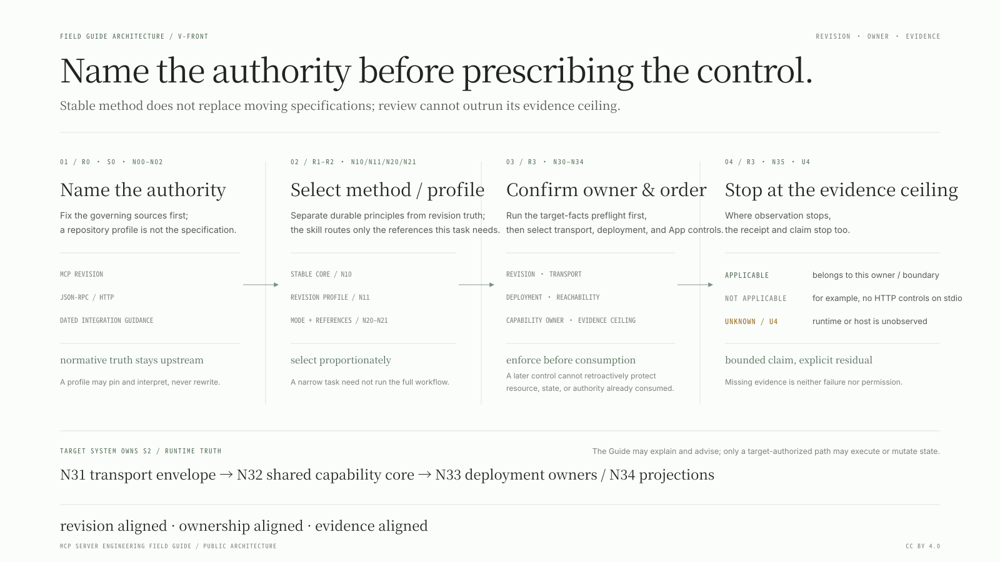

# MCP Server Engineering Field Guide

A revision-aware engineering method for deciding what an MCP server actually needs, where each control belongs, and what evidence proves it.

[简体中文](README.zh-CN.md) · English

## What problem this solves

MCP reviews go wrong when they apply the newest revision to historical code, require HTTP controls from a parent-owned stdio server, confuse deployment policy with implementation invariants, or promote implementer-authored tests into independent assurance. This guide keeps revision, transport, ownership, and evidence claims aligned with the server that actually exists.

In a 30-second example: a stdio-only server should mark Host, Origin, CORS, and HTTP body framing `not applicable`; its parent/OS process boundary owns reachability and caller possession without becoming an HTTP authentication protocol; and source inspection or project-local tests must stay below independent reproduction on the evidence ladder.



## Who this is for

- Maintainers designing or reviewing remote, HTTP, multi-revision, stateful, effectful, or MCP App implementations.
- Reviewers who need to distinguish protocol requirements from host, proxy, deployment, and product policy.
- Teams migrating revisions or producing evidence that another engineer can inspect and reproduce.

It is intentionally more method than a small private, parent-owned stdio server usually needs. For a narrow wording edit, protocol explanation, or local helper with no disputed boundary, use the smallest relevant reference and stop.

## Validation status

Release `2.0.1` passes 32 repository tests, portable-package and public-text validators, bilingual/profile consistency checks, and the full evaluation-corpus gate. The byte-identical installed skill completed one positive discovery canary and eight scored synthetic scenarios under rubric `1.1.0`; all nine were `valid-completed` and passed their critical items. The [dogfood report](evaluations/skill-v0.1.0/REPORT.md), full projected answers, and same-owner receipts are public. They are not independent assurance or a no-skill A/B comparison.

The project separates four things that age at different rates:

- the [stable engineering core](FIELD-GUIDE.md) ([简体中文](FIELD-GUIDE.zh-CN.md)): capability ownership, trust boundaries, evidence discipline, resource budgets, egress, deployment, and verification;
- [protocol profiles](profiles/) ([简体中文](profiles/README.zh-CN.md)): the repository's pinned, revision-specific reference layer, grounded in the named primary specifications;
- [case studies](case-studies/): public, pinned evidence that keeps the general method grounded in real failures, with English and Simplified Chinese peers;
- a distributable [`mcp-server-engineering` skill](skill/mcp-server-engineering/SKILL.md): a thin workflow controller that loads only the relevant references.

The native-SVG front door above is the one-glance `V-FRONT` view. The bilingual
[architecture atlas](ARCHITECTURE.md) ([简体中文](ARCHITECTURE.zh-CN.md)) then
connects the same model to external authority, target-system ownership,
same-owner evaluation, and release maintenance. Its three deep semantic views
retain native landscape and portrait siblings with editable Excalidraw geometry;
the front door is a separate wide editorial view, not a crop or replacement for
the atlas.

## Start here

- Designing a server: read [Field Guide sections 1–4](FIELD-GUIDE.md#1-the-central-model-a-partially-ordered-capability-boundary), then select the intended profile in [VERSION-REGISTER.json](VERSION-REGISTER.json).
- Auditing an existing server: pin its source revision, identify its declared MCP revision and deployment reachability, then use the [claim and evidence method](FIELD-GUIDE.md#2-evidence-discipline).
- Upgrading protocol revisions: compare the applicable files in [profiles/](profiles/) and keep historical tests bound to the revision they were written for.
- Learning from the originating implementation: use the sanitized [thinking-block case study](case-studies/gpt-thinking-block-mcp/CASE-STUDY.md).
- Running an agent workflow: invoke the packaged skill in [skill/mcp-server-engineering](skill/mcp-server-engineering/SKILL.md).
- Reading the complete ownership and feedback topology: use the [architecture atlas](ARCHITECTURE.md) and its three bilingual views in native landscape and portrait layouts.
- Maintaining or releasing the reference: follow the [maintenance workflow](MAINTENANCE.md) and [changelog](CHANGELOG.md).

## Version model

The guide and the protocols have independent versions.

```text
guide release
    ├── stable core model
    ├── pinned normative protocol profiles
    ├── dated moving-integration assessments
    └── case-study evidence receipts
```

The profile set registered for release `2.0.1` covers MCP `2025-06-18`, `2025-11-25`, and `2026-07-28`, plus JSON-RPC 2.0 and HTTP RFC 9110/9112. An older server is reviewed against the revision it declares; a new design should consult the latest supported official profile. See [VERSION-REGISTER.json](VERSION-REGISTER.json).

English and Simplified Chinese documents are maintained as semantic peers. They share the same version, section identifiers, profile IDs, claim IDs, receipt IDs, and evidence status. English protocol keywords and identifiers remain canonical in both languages.

## Publication status

Release `2.0.1` is published at [IndelibleVivi/mcp-server-engineering-field-guide](https://github.com/IndelibleVivi/mcp-server-engineering-field-guide). Publication state is recorded in [VERSION-REGISTER.json](VERSION-REGISTER.json).

The guide, profiles, case studies, and evidence prose are licensed under [CC BY 4.0](LICENSES/CC-BY-4.0.txt). The distributable skill, scripts, templates, and machine-readable project files are licensed under [Apache-2.0](LICENSES/Apache-2.0.txt). See [LICENSING.md](LICENSING.md) for the exact file boundary. No license is inherited from a case-study repository.

## Authorship and provenance

See [AUTHORS.md](AUTHORS.md) and [ATTRIBUTION.md](ATTRIBUTION.md). Private working continuity, raw model transcripts, local machine paths, and unsanitized execution logs are intentionally not part of this repository.
