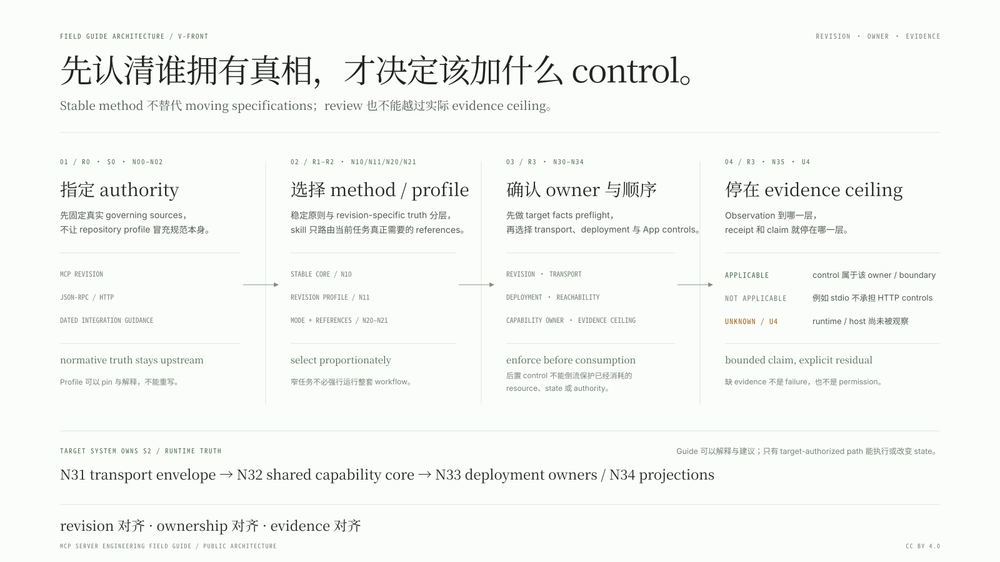

# MCP Server Engineering Field Guide

一套按实际协议版本、传输方式和部署边界，判断 MCP server 需要什么、由谁负责、怎样证明的工程方法。

简体中文 · [English](README.md)

## 解决什么问题

MCP review 最容易在四处失真：拿最新 revision 追溯审判历史代码；给 parent-owned stdio server 强加 HTTP controls；把 deployment policy 与 implementation invariants 混在一起；或者把 implementer-authored tests 抬高成 independent assurance。本指南让 revision、transport、ownership 与 evidence claims 始终对应实际存在的 server。

一个 30 秒例子：stdio-only server 应把 Host、Origin、CORS 与 HTTP body framing 标记为 `not applicable`；parent/OS process boundary 负责 reachability 与 caller possession，但不会因此变成 HTTP authentication protocol；source inspection 或 project-local tests 也必须停留在 independent reproduction 以下的 evidence level。



## 适合谁

- 设计或审查 remote、HTTP、multi-revision、stateful、effectful 或 MCP App implementations 的 maintainer；
- 需要区分 protocol requirements、host、proxy、deployment 与 product policy 的 reviewer；
- 正在迁移 revision，或需要产出可由其他工程师检查与复现的 evidence 的团队。

对于小型 private、parent-owned stdio server，本项目往往比实际需要的方法更完整。若任务只是窄幅 wording edit、protocol explanation，或没有争议边界的 local helper，应只使用最相关的 reference，然后停下来。

## 验证状态

Release `2.0.1` 通过 32 个 repository tests、portable-package / public-text validators、bilingual/profile consistency checks，以及完整 evaluation-corpus gate。Byte-identical installed skill 在 rubric `1.1.0` 下完成一个 positive discovery canary 与八个 scored synthetic scenarios；九个 runs 全部为 `valid-completed`，并通过所有 critical items。[Dogfood report](evaluations/skill-v0.1.0/REPORT.zh-CN.md)、完整 projected answers 与 same-owner receipts 均已公开；它们不是 independent assurance，也不是 no-skill A/B comparison。

本项目把老化速度不同的四层内容分开：

- [稳定工程核心](FIELD-GUIDE.zh-CN.md)（[English](FIELD-GUIDE.md)）：capability ownership、trust boundaries、evidence discipline、resource budgets、egress、deployment 与 verification；
- [protocol profiles](profiles/README.zh-CN.md)（[English](profiles/README.md)）：本仓库基于具名 primary specifications 固定下来的 revision-specific reference layer；
- [case studies](case-studies/)：以 public、pinned evidence 把通用方法锚定在真实 failure modes 上，并维护中英 semantic peers；
- 可分发的 [`mcp-server-engineering` skill](skill/mcp-server-engineering/SKILL.md)：只加载当前任务真正需要的 reference 的轻量 workflow controller。

上方 native-SVG front door 是一眼读懂的 `V-FRONT` view。Bilingual
[architecture atlas](ARCHITECTURE.zh-CN.md)（[English](ARCHITECTURE.md)）再把同一
model 与 external authority、target-system ownership、same-owner evaluation 及
release maintenance 连接起来。三组 deep semantic views 继续保留 native landscape /
portrait siblings 与 editable Excalidraw geometry；front door 是独立的 wide editorial
view，不是 atlas 的 crop 或替代品。

## 从哪里开始

- 设计新 server：先读 [Field Guide 第 1–4 节](FIELD-GUIDE.zh-CN.md#1-中央模型partially-ordered-capability-boundary)，再从 [VERSION-REGISTER.json](VERSION-REGISTER.json) 选择目标 profile。
- 审查现有 server：pin source revision，识别它声明的 MCP revision 与 deployment reachability，再使用 [claim / evidence 方法](FIELD-GUIDE.zh-CN.md#2-evidence-discipline)。
- 升级 protocol revision：对比 [profiles/](profiles/README.zh-CN.md) 中适用的文件，并让 historical tests 继续绑定其原始 revision。
- 阅读起源实现：使用已去除私人工作痕迹的 [thinking-block case study](case-studies/gpt-thinking-block-mcp/CASE-STUDY.zh-CN.md)。
- 运行 agent workflow：调用 [skill/mcp-server-engineering](skill/mcp-server-engineering/SKILL.md) 中打包的 skill。
- 阅读完整 ownership / feedback topology：使用 [architecture atlas](ARCHITECTURE.zh-CN.md) 与其中三组 bilingual views 的 native landscape / portrait layouts。
- 维护或发布 reference：遵循 [maintenance workflow](MAINTENANCE.zh-CN.md) 与 [changelog](CHANGELOG.zh-CN.md)。

## Version model

Guide 与 protocols 独立 versioning：

```text
guide release
    ├── stable core model
    ├── pinned normative protocol profiles
    ├── dated moving-integration assessments
    └── case-study evidence receipts
```

Release `2.0.1` 登记的 profile set 覆盖 MCP `2025-06-18`、`2025-11-25`、`2026-07-28`，以及 JSON-RPC 2.0 与 HTTP RFC 9110/9112。审查旧 server 时，依据它声明的 revision；设计新 server 时，查询当前支持的最新 official profile。详见 [VERSION-REGISTER.json](VERSION-REGISTER.json)。

English 与简体中文文档作为 semantic peers 维护：version、section identifiers、profile IDs、claim IDs、receipt IDs 与 evidence status 一致；English protocol keywords 与 identifiers 在两种语言中都保持 canonical。

## Publication status

Release `2.0.1` 已发布到 [IndelibleVivi/mcp-server-engineering-field-guide](https://github.com/IndelibleVivi/mcp-server-engineering-field-guide)；publication state 记录在 [VERSION-REGISTER.json](VERSION-REGISTER.json)。

Guide、profiles、case studies 与 evidence prose 使用 [CC BY 4.0](LICENSES/CC-BY-4.0.txt)；可分发 skill、scripts、templates 与 machine-readable project files 使用 [Apache-2.0](LICENSES/Apache-2.0.txt)。确切 file boundary 见 [LICENSING.md](LICENSING.md)。任何 license 都不是从 case-study repository 继承而来。

## Authorship 与 provenance

见 [AUTHORS.md](AUTHORS.md) 与 [ATTRIBUTION.md](ATTRIBUTION.md)。私人 working continuity、raw model transcripts、本机路径和未清理的 execution logs 均不属于这个 repo。
