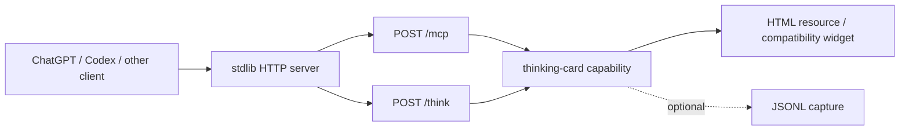

# Case study: hardening a single-file MCP renderer server

This case study follows a small, dependency-free Python project that exposes a thinking-card renderer through MCP and REST. It studies the engineering contract of the bundled runnable server. It does not evaluate the product's purpose, ethics, prompt design, or interaction model.

[简体中文](CASE-STUDY.zh-CN.md) · English

## Pinned public artifacts

| Role | Public artifact |
| --- | --- |
| Upstream project | [`sibylsea-hub/gpt-thinking-block-mcp`](https://github.com/sibylsea-hub/gpt-thinking-block-mcp) |
| Upstream baseline | [`681b99124234628ad9fb01703925a2cd4396c002`](https://github.com/sibylsea-hub/gpt-thinking-block-mcp/commit/681b99124234628ad9fb01703925a2cd4396c002) |
| Independently maintained hardened fork | [`IndelibleVivi/gpt-thinking-block-mcp`](https://github.com/IndelibleVivi/gpt-thinking-block-mcp) |
| First hardened implementation | [`d43ebfb`](https://github.com/IndelibleVivi/gpt-thinking-block-mcp/commit/d43ebfb) |
| Boundary documentation | [`e204360`](https://github.com/IndelibleVivi/gpt-thinking-block-mcp/commit/e204360) |
| Review follow-up | [`b533b84`](https://github.com/IndelibleVivi/gpt-thinking-block-mcp/commit/b533b84) |
| Assessed fork revision | [`ec1379aa141a02a150ef7ce82ea4f5e92f55c72b`](https://github.com/IndelibleVivi/gpt-thinking-block-mcp/commit/ec1379aa141a02a150ef7ce82ea4f5e92f55c72b) |
| Public CI receipt | [GitHub Actions run 31888232847](https://github.com/IndelibleVivi/gpt-thinking-block-mcp/actions/runs/31888232847) |

The fork identifies itself as independent and does not imply an upstream release, endorsement, or maintenance obligation.

## Starting architecture

The project was intentionally small:

The small dependency footprint was not the problem. The risk came from one file owning several distinct contracts at once: HTTP/1.1 parsing, JSON decoding, JSON-RPC classification, MCP lifecycle behavior, REST parity, shared mutable state, filesystem capture, deployment metadata, and a human-facing widget.

## Declared protocol and scope

The assessed fork intentionally implements MCP `2025-06-18`, not the current `2026-07-28` stateless revision. Historical behavior is judged against the declared profile:

- `initialize` negotiation is valid for this revision;
- JSON-RPC batching is rejected;
- a stateless server may omit optional `Mcp-Session-Id` and GET/SSE behavior;
- accepted notifications and client responses receive the transport outcome required by the selected revision;
- current-revision requirements such as `server/discover`, per-request `_meta`, routing headers, and `resultType` are migration work, not retroactive defects.

This distinction prevented an apparently modern review from condemning correct historical behavior.

## Contract failures found

The review began with public claims and observable behavior, then mapped each claim to code and tests. The high-value failures were not exotic exploits; they were disagreements between layers.

| Boundary | Failure class | Consequence |
| --- | --- | --- |
| MCP envelope | malformed requests, notifications, and responses could share loose paths | side-effect and response behavior could diverge from JSON-RPC kind |
| Tool authority | MCP and `/think` did not necessarily share every validator and budget | one public route could bypass the intended capability contract |
| HTTP framing | incomplete, oversized, ambiguous, or malformed bodies lacked one explicit bounded policy | socket/thread/memory consumption and keep-alive desynchronization risk |
| Authority | Host, absolute-form target, forwarded values, and advertised base URL were not one explicit model | caller-controlled authority could reach routing or generated metadata |
| Browser boundary | Origin validation and CORS reflection could be confused | a guard could be present while response policy remained too broad |
| Runtime state | limiter and capture behavior needed server-wide ownership and locking | thread-per-request execution could race or enforce per-handler state |
| Side-effect metadata | capture could write while a tool remained described as read-only | host/model consent metadata disagreed with real effect |
| Deployment | process bind, container bind, and host publication were described as one setting | a safe local default could be silently lost in Compose or VPS use |
| Result delivery | serialization and disconnect behavior were not treated separately from execution | a completed side effect could be retried after the result was lost |

## Chosen design

The patch retained the single-file, standard-library shape. It did not add OAuth, a session manager, a framework migration, or a second product architecture.

### Shared capability core

Both MCP `tools/call` and REST `/think` enter the same argument validator, resource constraints, global limiter, capture function, and result semantics. The transport envelopes remain different, but neither route owns a more privileged version of the action.

### Honest optional features

The server has no product need for server-initiated messaging or connection-scoped state. It therefore returns JSON and answers `GET /mcp` with `405`, rather than fabricating an SSE stream or constant session ID. Optional protocol machinery is absent unless the state behind it exists.

### Layered network boundary

- direct execution defaults to `127.0.0.1`;
- the process binds `0.0.0.0` inside the container so port forwarding can reach it;
- Compose publishes the host port on `127.0.0.1`;
- exact Host and Origin policies protect the listener boundary;
- optional shared-token auth is documented as a limited non-OAuth mode that only works for clients able to send the header;
- broader exposure still requires an operator-owned HTTPS and authentication perimeter.

### Bounded request handling

The server rejects unsupported transfer coding, duplicate or invalid framing, oversized declared bodies, unsupported media types, invalid UTF-8, non-finite JSON numbers, lone surrogates, and invalid MCP envelopes. A body receives an absolute completion deadline, not only a renewable socket idle timeout. Unsafe early rejection closes the connection when unread bytes could otherwise poison keep-alive parsing.

### Effect and metadata alignment

Capture is opt-in. When enabled, writes are serialized, file permissions are tightened, raw thinking is not copied to stdout, and the tool annotations change to disclose a write side effect. A capture failure does not change the capability result.

## What independent review changed

Two separate review lanes attacked different seams. Neither review was treated as authority by itself; findings were reproduced against pinned source before adoption. The reconciliation is in [REVIEW-RECONCILIATION.md](REVIEW-RECONCILIATION.md).

Review follow-up corrected, among other items:

- effective-authority handling across Host and absolute-form request targets;
- framing failures being mislabeled as JSON-RPC parse errors;
- Bearer challenge and generated auth metadata disagreement;
- unsafe numeric and Unicode edge cases;
- malformed request-target and forwarded-base handling;
- keep-alive caching of a prior request's authority;
- `204 No Content` framing;
- raw capture leakage during failure reporting.

One regression was created by hardening itself: caching the parsed route by path alone let a later same-path keep-alive request reuse the previous Host decision. A test that changed Host on the second request found it. The cache key was widened to include the raw Host values. This is a useful example of a guard introducing new shared state and therefore a new invalidation contract.

## Verification result

At the assessed fork revision:

- the public CI run compiled the project and passed all 60 tests on Python 3.9 and 3.12;
- a separate local receipt reproduced 60 passing tests on CPython 3.13.3 / macOS 26.5.2 arm64;
- local raw-socket probes reproduced four residual low-level server behaviors;
- static checks covered Python syntax, workflow/Compose parsing, diff whitespace, public documentation alignment, and capture defaults;
- Docker configuration was inspected statically, but no local Docker build/runtime receipt existed.

See [TEST-MATRIX.md](TEST-MATRIX.md) and [PUBLIC-EVIDENCE-INDEX.md](PUBLIC-EVIDENCE-INDEX.md). “60 tests pass” describes implemented expectations; it is not independent proof that those expectations are complete.

## Residual boundaries

The assessed revision still has intentionally visible limits:

1. `BaseHTTPRequestHandler` header parsing uses a renewable socket idle timeout, not an absolute header-completion deadline.
2. `ThreadingHTTPServer` has no bounded worker admission before header completion; twelve incomplete connections produced twelve handler threads in the recorded probe.
3. inherited `Expect: 100-continue` handling sent `100 Continue` before a denied-Origin request received its final 403.
4. ordinary remote disconnects could produce `BrokenPipeError` tracebacks in the inherited response path.
5. Docker runtime, real reverse-proxy behavior, production TLS/auth, and hostile-internet scheduling were not executed in the recorded local environment.
6. the widget targets ChatGPT's compatibility bridge, not a portable standard MCP Apps `postMessage` implementation.
7. OAuth, accounts, tenancy, and a production perimeter are explicitly out of scope.
8. the server accepts string and integer request IDs but deliberately rejects fractional numeric IDs. Base JSON-RPC discourages rather than universally forbids fractional IDs, so this is a compatibility narrowing, not a normative JSON-RPC fact.

The first two become meaningful availability risks if the stdlib listener is directly exposed to untrusted traffic. None of the four wire probes demonstrated capability execution or capture bypass.

## Reusable lessons

- Start from the artifact's runnable contract, not the author's intended emphasis.
- Pin the protocol revision before calling behavior compliant or defective.
- Remove fake optional machinery when the product does not own its state.
- Put equivalent public routes behind one capability authority.
- Treat header parsing, connection admission, body parsing, capability execution, and response writing as distinct resource surfaces.
- Ask reviewers to attack orthogonal seams; then reproduce every claim.
- Record residuals without converting every finding into scope expansion.
- Keep product behavior stable when the task is transport hardening, and make that invariant testable.
