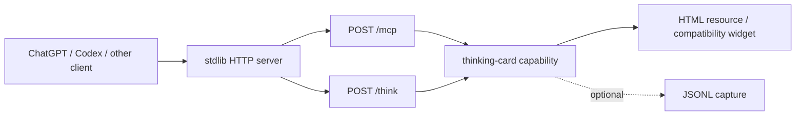

# Case study：加固单文件 MCP renderer server

本 case study 跟踪一个小型、零 dependency 的 Python 项目：它通过 MCP 与 REST 暴露 thinking-card renderer。这里研究 bundled runnable server 的工程 contract，不评价产品用途、道德、prompt design 或 interaction model。

简体中文 · [English](CASE-STUDY.md)

## Pinned public artifacts

| Role | Public artifact |
| --- | --- |
| Upstream project | [`sibylsea-hub/gpt-thinking-block-mcp`](https://github.com/sibylsea-hub/gpt-thinking-block-mcp) |
| Upstream baseline | [`681b99124234628ad9fb01703925a2cd4396c002`](https://github.com/sibylsea-hub/gpt-thinking-block-mcp/commit/681b99124234628ad9fb01703925a2cd4396c002) |
| Independently maintained hardened fork | [`IndelibleVivi/gpt-thinking-block-mcp`](https://github.com/IndelibleVivi/gpt-thinking-block-mcp) |
| First hardened implementation | [`d43ebfb`](https://github.com/IndelibleVivi/gpt-thinking-block-mcp/commit/d43ebfb) |
| Boundary documentation | [`e204360`](https://github.com/IndelibleVivi/gpt-thinking-block-mcp/commit/e204360) |
| Review follow-up | [`b533b84`](https://github.com/IndelibleVivi/gpt-thinking-block-mcp/commit/b533b84) |
| Assessed fork revision | [`ec1379aa141a02a150ef7ce82ea4f5e92f55c72b`](https://github.com/IndelibleVivi/gpt-thinking-block-mcp/commit/ec1379aa141a02a150ef7ce82ea4f5e92f55c72b) |
| Public CI receipt | [GitHub Actions run 31888232847](https://github.com/IndelibleVivi/gpt-thinking-block-mcp/actions/runs/31888232847) |

Fork 明确标注为 independent，不暗示 upstream release、endorsement 或 maintenance obligation。

## Starting architecture

项目刻意保持很小：

Dependency 少不是问题。风险来自一个文件同时拥有多项不同 contract：HTTP/1.1 parsing、JSON decoding、JSON-RPC classification、MCP lifecycle behavior、REST parity、shared mutable state、filesystem capture、deployment metadata 与 human-facing widget。

## Declared protocol 与 scope

被审 fork 明确实现 MCP `2025-06-18`，不是当前 `2026-07-28` stateless revision。Historical behavior 要按 declared profile 判断：

- `initialize` negotiation 对这一 revision 合法；
- JSON-RPC batching 被拒绝；
- Stateless server 可以省略 optional `Mcp-Session-Id` 与 GET/SSE behavior；
- accepted notifications 与 client responses 获得 selected revision 要求的 transport outcome；
- `server/discover`、per-request `_meta`、routing headers 与 `resultType` 等 current-revision requirements 是 migration work，不是 retroactive defects。

这个区分避免一场表面“现代”的 review 把正确 historical behavior 判错。

## Contract failures found

Review 从 public claims 与 observable behavior 出发，再把每条 claim 映射到 code 与 tests。最有价值的 failure 并非 exotic exploit，而是 layers 之间的 disagreement。

| Boundary | Failure class | Consequence |
| --- | --- | --- |
| MCP envelope | malformed requests、notifications 与 responses 可能走 loose shared paths | Side-effect / response behavior 会偏离 JSON-RPC kind |
| Tool authority | MCP 与 `/think` 未必共享所有 validator 与 budget | 某条 public route 可能绕过 intended capability contract |
| HTTP framing | incomplete、oversized、ambiguous 或 malformed body 缺少统一 bounded policy | Socket/thread/memory consumption 与 keep-alive desynchronization risk |
| Authority | Host、absolute-form target、forwarded values 与 advertised base URL 没有一个显式 model | Caller-controlled authority 可能进入 routing 或 generated metadata |
| Browser boundary | Origin validation 与 CORS reflection 容易混淆 | Guard 可能存在，但 response policy 仍过宽 |
| Runtime state | Limiter 与 capture 需要 server-wide ownership 和 lock | Thread-per-request execution 可能产生 race 或 per-handler state |
| Side-effect metadata | Capture 会写文件，tool 却可能仍被描述为 read-only | Host/model consent metadata 与真实 effect 不一致 |
| Deployment | Process bind、container bind 与 host publication 被描述成同一个 setting | Safe local default 可能在 Compose 或 VPS 使用时静默丢失 |
| Result delivery | Serialization / disconnect 未与 execution 分开 | 已完成 side effect 可能因 result 丢失而被 retry |

## Chosen design

Patch 保留 single-file、standard-library 形态，没有加入 OAuth、session manager、framework migration 或第二套产品架构。

### Shared capability core

MCP `tools/call` 与 REST `/think` 进入同一 argument validator、resource constraints、global limiter、capture function 与 result semantics。Transport envelopes 不同，但任何 route 都不能拥有更高权限版本的 action。

### Honest optional features

Server 没有 server-initiated messaging 或 connection-scoped state 的产品需求。因此它返回 JSON，并让 `GET /mcp` 返回 `405`，而不是伪造 SSE stream 或 constant session ID。Optional protocol machinery 只有在其背后真实 state 存在时才出现。

### Layered network boundary

- Direct execution 默认 `127.0.0.1`；
- Process 在 container 内 bind `0.0.0.0`，使 port forwarding 可达；
- Compose 在 host 侧只发布到 `127.0.0.1`；
- Exact Host / Origin policies 保护 listener boundary；
- Optional shared-token auth 明确写成有限、非 OAuth 模式，只适用于能发送该 header 的 clients；
- 更广 exposure 仍需要 operator-owned HTTPS 与 authentication perimeter。

### Bounded request handling

Server 拒绝 unsupported transfer coding、duplicate/invalid framing、oversized declared body、unsupported media type、invalid UTF-8、non-finite JSON number、lone surrogate 与 invalid MCP envelope。Body 使用 absolute completion deadline，不只依赖可续期 socket idle timeout。Early rejection 若留下 unread bytes 而可能 poison keep-alive parsing，就关闭 connection。

### Effect 与 metadata alignment

Capture opt-in。启用时，writes serialized、file permissions tightened、raw thinking 不复制到 stdout，tool annotations 会声明 write side effect。Capture failure 不改变 capability result。

## Independent review 改变了什么

两个独立 review lanes 攻击不同 seams。任何 review 都不被单独当作 authority；finding 必须针对 pinned source reproduced 后才采用。Reconciliation 见 [REVIEW-RECONCILIATION.zh-CN.md](REVIEW-RECONCILIATION.zh-CN.md)。

Review follow-up 修正的内容包括：

- Host 与 absolute-form request-target 的 effective-authority handling；
- Framing failure 被错误标成 JSON-RPC parse error；
- Bearer challenge 与 generated auth metadata disagreement；
- Unsafe numeric / Unicode edge cases；
- Malformed request-target 与 forwarded-base handling；
- Keep-alive 缓存前一 request authority；
- `204 No Content` framing；
- Failure reporting 时泄漏 raw capture。

Hardening 本身还创造过一个 regression：只按 path cache parsed route，使后续同 path keep-alive request 复用前一 Host decision。一个第二次 request 改 Host 的 test 找到了它。修复方式是让 cache key 同时包含 request target 与 raw Host values。这说明 guard 引入 shared state 后，也同步引入 invalidation contract。

## Verification result

在 assessed fork revision：

- Public CI 在 Python 3.9 / 3.12 compile project，并通过全部 60 tests；
- 独立 local receipt 在 CPython 3.13.3 / macOS 26.5.2 arm64 复现 60 tests pass；
- Local raw-socket probes 复现四项 residual low-level server behaviors；
- Static checks 覆盖 Python syntax、workflow/Compose parsing、diff whitespace、public documentation alignment 与 capture defaults；
- Docker configuration 完成 static inspection，但没有 local Docker build/runtime receipt。

见 [TEST-MATRIX.zh-CN.md](TEST-MATRIX.zh-CN.md) 与 [PUBLIC-EVIDENCE-INDEX.zh-CN.md](PUBLIC-EVIDENCE-INDEX.zh-CN.md)。“60 tests pass”只描述已实现 expectations，不是这些 expectations 完整性的 independent proof。

## Residual boundaries

Assessed revision 仍保留以下明确 limits：

1. `BaseHTTPRequestHandler` header parsing 使用 renewable socket idle timeout，而非 absolute header-completion deadline。
2. `ThreadingHTTPServer` 在 header completion 前没有 bounded worker admission；recorded probe 中 12 条 incomplete connections 产生 12 个 handler threads。
3. Inherited `Expect: 100-continue` handling 先发 `100 Continue`，随后 denied-Origin request 才收到 final 403。
4. Ordinary remote disconnect 会在 inherited response path 产生 `BrokenPipeError` traceback。
5. Docker runtime、real reverse-proxy behavior、production TLS/auth 与 hostile-internet scheduling 未在 recorded local environment 执行。
6. Widget 面向 ChatGPT compatibility bridge，并非 portable standard MCP Apps `postMessage` implementation。
7. OAuth、accounts、tenancy 与 production perimeter 明确 out of scope。
8. Server 接受 string / integer request IDs，但刻意拒绝 fractional numeric IDs。Base JSON-RPC 只 discourage，而非普遍 forbid fractional IDs，因此这是 compatibility narrowing，不是 normative JSON-RPC fact。

若 stdlib listener 直接暴露给 untrusted traffic，前两项会成为有意义的 availability risks。四项 wire probes 都没有展示 capability execution 或 capture bypass。

## Reusable lessons

- 从 artifact 的 runnable contract 出发，而不是从作者想强调什么出发。
- 先 pin protocol revision，再判 compliant 或 defective。
- 产品不拥有 state 时，删除 fake optional machinery。
- Equivalent public routes 共用一个 capability authority。
- 把 header parsing、connection admission、body parsing、capability execution 与 response writing 当作不同 resource surfaces。
- 让 reviewers 攻击 orthogonal seams；随后 reproduce 每条 claim。
- 记录 residuals，但不要把每个 finding 自动转成 scope expansion。
- Transport hardening 时保持 product behavior 稳定，并让这一 invariant 可测试。
